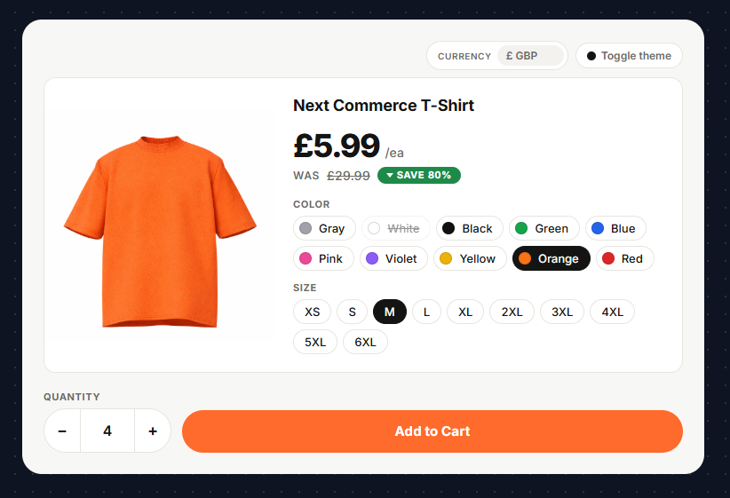

# Changelog

## [0.4.38] — 2026-08-20 — One Phone Check, and the Order Carries E.164

A phone number the checkout accepted is now judged the same way everywhere, and the number that reaches the orders API is international. Two fixes with the same root: the question "can this phone be used" was being asked in five places against four different yardsticks, and none of them was the one that could actually answer it.

Nothing to add to your pages. **Before you upgrade** matters if your test data or QA scripts fill a placeholder phone number.

### Fixed

- **A phone number nobody holds no longer reaches the orders API.** ([#58](https://github.com/NextCommerceCo/campaign-cart/issues/58))

  `0000000000` and `1234567890` were accepted on a card checkout: no message appeared under the phone field, validation passed, and the order was created with the number on it. Ten digits is the right length for a US number, and length was all anything checked — including `intl-tel-input`'s own `isValidNumber()`, which the library documents as a length test despite its name.

  Three shapes are now refused, whatever their length says:

  | Refused | Description |
  |---|---|
  | `0000000000` | Every digit the same |
  | `1234567890` | Digits running up or down |
  | `1212121212` | A short pattern repeated |

  A number of the wrong length for its country is refused as before. Everything else is accepted, including a number that could not be checked at all, because the library that checks it arrives over the network and a shopper should not be blocked for a delay that is ours.

- **The order carries E.164.** A shopper types `(415) 555-2671` and the API is now sent `+14155552671`, on the shipping address, the billing address and the customer record.

  ```js
  // What the orders API receives for a number typed nationally
  { shipping_address: { phone_number: '+14155552671' },
    user:             { phone_number: '+14155552671' } }
  ```

  The number was already converted as the shopper typed, but only from the moment the phone library finished loading a script it fetches separately. A shopper who finished typing before that landed, or who filled the field on an earlier step, sent a national number for the API to convert. Submitting now waits for that script, briefly, and the number is converted once more where every order passes. When it still cannot be converted the national number is sent as before, and the SDK logs that it did so rather than leaving it to be discovered.

- **A message no longer disappears when a different field is corrected.** On a page whose inputs are not wrapped in `.form-group` or `.form-input` elements, every error message was appended to the form itself, and clearing any field removed whichever message came first. The shopper was left with a field outlined in red, no text under it, and no way to make it go away. Each message now names the field it belongs to.

- **Choosing a country no longer rewrites a phone number the shopper wrote internationally.** Picking the address country re-bases the phone field on that country, which keeps the national digits and swaps the dial code in front of them: a stated `+66 81 234 5678` became `+1 81 234 5678`, and that is what the field then showed, with no message to explain it. A number carrying its own country code has already said which country it belongs to, and the address country is a separate question — someone shipping to the United States may well be reachable on a Thai phone.

- **A step gate checks the phone whether or not it is required.** On a multi-step checkout, the phone was only validated on a step where the markup marked the field `required`. A shopper could go back, replace a good number with a bad one, and carry it forward to a page where the field was no longer on screen to correct.

- **A landline is no longer refused for being the wrong length for a mobile.** The phone library was left on its default of validating mobile numbers only, so in countries where a landline is not the same length as a mobile, a shopper who gave one was told their number was invalid with no way to satisfy the form.

- **The same yardstick now applies to the prospect cart.** It carried its own, looser rule, so a number could be good enough to capture a lead and not good enough to submit the order that lead turns into.

### Changed

- **Error messages carry `data-next-error-for`**, naming the field they belong to. It is written by the SDK, not something you put in your markup, and it is what scopes clearing one field's message to that field. Documented in the checkout form's attribute reference.

- **A new log line reports what a stricter check would have refused.** The phone library can also answer whether a number really exists, not just whether it is the right length. That check is asked and deliberately not acted on: its rules change monthly and an SDK release pinned on your page freezes them, so over time it would start refusing real numbers. `Phone accepted on length but refused by precise validation; not blocked` records how often it disagrees, so the decision to promote it can be made from real orders rather than from an argument.

### Before you upgrade

**A placeholder phone number in your test data will now be refused.** `0000000000`, `1234567890`, `5555555555`, `4242424242` and `1212121212` are all junk shapes as of this release. A QA script, a seeded test order or a browser autofill entry that uses one will stop at the phone field with `Please enter a valid phone number`. Give it a number of the right shape instead — `4155552671` is used by this SDK's own browser tests.

**Nothing changes for a page that styles `.next-error-label`.** The class, the element and where it sits are all the same; the new attribute is added alongside.

---

## [0.4.37] — 2026-08-18 — The FOMO Popup Leaves the SDK, and getCartData Lists Every Cart Line

One feature removed and one long-standing bug fixed. The removal only concerns a page that called `next.fomo()`. The fix concerns any code that reads `next.getCartData()`, and it deletes the empty `enrichedItems` field from the cart state along the way. Before you upgrade covers both.

### Removed

- **The FOMO features are removed from the SDK.** ([#560](https://github.com/NextCommerceCo/campaigns-app/issues/560))

  Four things go with them:

  | Removed | Description |
  |---|---|
  | `next.fomo(config)` | Started and configured the popup |
  | `next.stopFomo()` | Stopped it |
  | `fomo:shown` | Fired once per popup shown |
  | `next-fomo-show` | Class on the popup while on screen |

  The exit-intent popup is untouched. `next.exitIntent()` and `next.disableExitIntent()` behave exactly as before, and exit intent is now the only entry under On-page popups in the JavaScript API reference.

### Fixed

- **`next.getCartData()` returns the cart's lines.**

  `cartLines` came back as an empty array no matter how full the cart was. The totals, campaign data and coupon codes beside it stayed correct, so it read as an empty cart rather than as a bug: page code and QA checks that gate on `cartData.cartLines.length` took the empty-cart path on a cart that was fine. ([#36](https://github.com/NextCommerceCo/campaign-cart/issues/36))

  The lines are now built from the cart's own items on each call, one line per item, so a line is in the snapshot the moment it is added.

  ```js
  const { cartLines } = next.getCartData();
  cartLines.forEach(line =>
    console.log(line.packageId, line.quantity, line.price.excl_tax.formatted)
  );
  ```

  A line carries its package, quantity and product details, plus whether it came from an upsell (`is_upsell`) and whether it repeats on a subscription (`is_recurring`). Its prices come as `excl_tax`, `incl_tax`, `original` and `savings`, each one a raw `value` and a `formatted` string. Two things to expect from those amounts:

  **They lag the API by a moment.** Until the calculate call answers, roughly 150 ms after an add, a line carries the campaign's prices, with no offer or coupon discount in them. Call `next.getCartData()` again inside a `cart:updated` handler when a discount has to be reflected; the event itself delivers the cart state, not this snapshot.

  **They carry no tax.** The calculate response has no tax figures in it, so `excl_tax` and `incl_tax` hold the same amount. Tax appears on the order, after checkout.

### Before you upgrade

Three notes for a page that used the FOMO popup, then one for anything reading the cart state.

**Search your pages for `next.fomo(` before taking this release.** The method is gone rather than left as a no-op, so a page that still calls it raises `next.fomo is not a function` at the call.

**A call inside `window.nextReady.push(...)` does not break the page.** The SDK catches what a ready callback throws and logs `[SDKInitializer] Ready callback error:`. The rest of that one callback is skipped, though, so anything set up after the `next.fomo()` line will not run. Move those lines into a callback of their own, or delete the call.

**There is no markup to clean up.** The popup had no `data-next-*` attribute of its own and built its own element, so nothing in your HTML refers to it. Any `next-fomo-show` rule left in a stylesheet is dead and can go whenever it suits you.

**`enrichedItems` is gone from the cart state.** The empty field `cartLines` used to read is no longer on the `cart:updated` payload, nor on the TypeScript `CartState`. A page reading `cart.enrichedItems` now gets `undefined` where it got `[]`, and a TypeScript build naming the field stops compiling. Read `items` for what the shopper chose, or `next.getCartData().cartLines` for priced rows.

---

## [0.4.36] — 2026-08-17 — Slow Payments, Refused Payments, and the Card Selected Again

Three things a shopper sees during checkout, all of them wrong in `0.4.35`. Nothing to add to your pages for any of them.

### Fixed

- **The loading overlay stays up until a card payment finishes.**

  On a phone, the overlay could vanish while the order was still being processed. The page looked idle again and the **Complete Purchase** button became clickable, so the shopper assumed the payment had failed and pressed it a second time, which raised the duplicate-purchase warning. Their first order had gone through the whole time. Observed on orders that took 60 to 150 seconds.

  The cause was a reset built for a shopper cancelling PayPal, Apple Pay or Google Pay, which returns to the page without the browser announcing a navigation. It ran for every payment method, and on a phone the event it listens for fires routinely mid-checkout, from the keyboard closing or a tap on the page. It is now limited to the express methods it was written for. A card or a local payment method is charged from the checkout page itself, so nothing the shopper does to that page can end the wait early. ([#75](https://github.com/NextCommerceCo/campaign-cart/issues/75))

- **The card is selected again when the checkout page loads.**

  A shopper arriving at a checkout found no payment method chosen and the card fields collapsed, and had to click the card option before they could type into it. A card radio that your markup ships as `checked` was unchecked by the SDK a moment after the page appeared. Only the card was affected: every other method was selected correctly on a return visit.

  Introduced in `0.4.35`, when the card became the only method whose internal name differed from the value you write on the page.

- **A refused payment is shown to the shopper, whichever method they chose.**

  A shopper refused by iDEAL, Bancontact, SEPA, TWINT, Affirm, Klarna or Link saw an idle page and no reason for it. The message was produced correctly and written into the card's error box, and that box is closed whenever a card is not the chosen method, so it was rendered inside a container of zero height and clipped out of sight.

  Every method's refusals are now readable, on the markup you already have. Where a page's only error box is the card's, the SDK moves it out of the card's collapsible section so the message can be seen.

- **A checkout that cannot proceed says so.** "Failed to process order. Please try again." and "the payment system is not ready" were both produced and never displayed, because they were filed under a field name no page has. Both reach the shopper now. A specific message from the payment provider, such as "Your card was declined", still wins over the generic one.

### New

- **An error box per payment method**, named for the method: `data-next-component="ideal-error"` beside `data-next-payment-method="ideal"`, and the same for every method you offer. Write `{method}-error-text` inside it for the message, or leave it out and the message goes into the box itself. `-` and `_` are interchangeable, so `apple-pay-error` and `apple_pay-error` are one name.

  Optional. A method with no box of its own uses `credit-error`, which is what every page had before this.

### Changed

- **A PayPal refusal is shown once.** It was written into `paypal-error` and `credit-error` at the same time, worded differently in each, so a page carrying both showed the shopper the same refusal twice.

- **Choosing a different payment method clears every error box on the page**, not the two the SDK used to know about. A refusal belongs to the method the shopper has just left.

- **An error box hides itself ten seconds after its own message**, rather than ten seconds after the first one. A second refusal arriving inside that window used to be wiped early.

### Before you upgrade

**The pay button now stays disabled for the whole of a slow payment.** That is the fix, and it is worth knowing if you time checkout steps or watch session recordings: a card payment that takes a minute now shows a minute of spinner, where it used to show an idle page. No page change is needed.

**Put `credit-error` outside `data-next-payment-form` when you next touch your template.** The SDK copes with it being inside, by moving it out when it has to. A box that starts outside never needs moving, and a `{method}-error` box for each method is better still.

---

## [0.4.35] — 2026-08-14 — Local Payment Methods, and Link as an Express Button

### Fixed

- **Local payment methods work on the checkout form.**

  Choosing one of the methods marked new below used to be read as a card payment, so the order was refused and the shopper never reached the payment page. Each is a radio option now, with nothing to fill in on your page: the shopper is sent to the provider to pay once the order exists.

  Every method the SDK supports, and the value to give `data-next-payment-method`:

  | Method | Value | Express button |
  |---|---|---|
  | Card | `credit` | no |
  | PayPal | `paypal` | yes |
  | Apple Pay | `apple_pay` | yes |
  | Google Pay | `google_pay` | yes |
  | Klarna | `klarna` | no |
  | Link **(new)** | `link` | yes **(new)** |
  | iDEAL **(new)** | `ideal` | no |
  | Bancontact **(new)** | `bancontact` | no |
  | SEPA Direct Debit **(new)** | `sepa_debit` | no |
  | TWINT **(new)** | `twint` | no |
  | Swish **(new)** | `swish` | no |
  | Affirm **(new)** | `affirm` | no |
  | Giropay **(new)** | `giropay` | no |
  | Sofort **(new)** | `sofort` | no |

  The card also answers to `card_token`, and it is the one method whose name changes on the way out: the order carries `card_token`. Every other method goes on the order under the same name you write. Apple Pay's button is left out on Android. A method the SDK does not list is sent to the API anyway, so this is what it names, not the limit of what it can charge.

  **SEPA Direct Debit is `sepa_debit`, and only that.** The platform's payment-methods guide calls the same method `sepa_direct`; the orders API does not take that name, so neither does the SDK. A page carrying it is refused rather than quietly working under a second identifier. No page could pay by SEPA before this release, so there is nothing to migrate: write `sepa_debit`. ([#74](https://github.com/NextCommerceCo/campaign-cart/issues/74))

- **Receipts name the payment method.** A Klarna order printed `klarna` and now prints `Klarna`. Every method an order can carry has a name.

- **The payment step reaches your reports for these methods.** It is recorded when the form is submitted, for methods that collect no payment details on the page. Klarna was the only affected method before this release.

### New

- **Link as an express button**, beside PayPal, Apple Pay and Google Pay. Link can also be a radio; a page carrying both shows it twice.

- **A method the SDK does not recognise is sent to the orders API.** A payment method the platform adds can be offered before an SDK release names it.

- **For TypeScript:** `PaymentMethod` and `CheckoutPaymentMethod` are now exported. `PaymentMethod` gained `swish` and `saved_card`; nothing was removed from it.

### Changed

- **Method names in markup use underscores:** `apple_pay`, not `apple-pay`. The older spellings and any casing still work.

- **Express method config accepts the same spellings:** `apple_pay`, `google_pay` and `link`, alongside `applePay` and `googlePay`.

### Before you upgrade

**Write `credit` for the card, not `card` or `credit_card`.** Those two reached the card form on earlier releases, because any unrecognised name did. They now go to the orders API and come back refused, with `Payment method "…" is not one the SDK knows` in the console.

**Receipt text changed.** `order.paymentMethod` prints `Klarna` where it printed `klarna`. If your own code or a tag reads that text, read the order's `payment_method` code instead.

**The payment step appears in reports where it did not before.** Campaigns offering Klarna or one of the new methods now record it, so that step's numbers are not comparable across this release.

---

## [0.4.34] — 2026-08-11 — One Website, Many Campaigns, Separate Carts

### Fixed

- **Two campaigns on the same website no longer share a shopping bag.**

  A browser files a saved cart against the website address, not against the campaign. Every campaign we host sits on one address, so a shopper who looked at two of them arrived at the second carrying the first one's items — and, more expensively, the first one's discount. A saved cart stores the exact rule each code matched, so the second campaign did not merely show the wrong products, it honoured pricing it never offered.

  **32 of the 52 things the SDK stores are now filed per campaign** — everything that describes what a shopper is doing in one funnel. The shopping bag, the half-filled checkout form, the completed order, the abandoned-cart record, countdown timers, the "don't show me that popup again" flag, the discount code that priced the order, where to send a shopper back after a payment gateway, the link they arrived on, the currency and country they picked, the attribution record, and every analytics session and visitor id. Nothing is added to your pages — the name is worked out from the API key the page already boots with and the folder it is served from. ([#69](https://github.com/NextCommerceCo/campaign-cart/issues/69))

### Before you upgrade

**There is nothing to add to your pages.** Every campaign is separated automatically, on markup you already have. The notes below are things to be aware of, not steps to carry out.

**Carts open right now start empty, once.** The saved names have changed, so a shopper who was mid-funnel when this ships comes back to an empty bag and reselects. It happens one time per shopper, and only to bags that were already open. The same applies to a remembered currency or country — the first page after the upgrade detects them again.

**Analytics counts people per campaign from here on.** Session and visitor ids are filed per campaign too, so one person who looks at two of your campaigns is now reported as two visitors rather than one, and each campaign counts its own sessions. Reports that compare periods across this release will show that step. Click ids and UTM tags are the exception and stay shared, so a paid click captured on one campaign is still readable from the next.

**One layout is worth a look: a funnel whose pages sit at different depths.** A campaign whose first page is `/hu/` and whose checkout is `/hu/checkout` resolves to two different names, and the bag will not survive the step between them. Keep every page of one funnel at the same depth, or pin the name with the optional tag below. Every other layout is handled — `/hu/earbuds`, `/hu/earbuds/checkout` and `/hu/earbuds/checkout/upsell1` all stay together, and so do `/promo-b.html` and `/promo-b-checkout.html`.

**Two funnels sharing one campaign API key** are kept apart when they sit in different top folders. In the same folder they share a bag, which is usually right: same campaign means same products and same prices, so a carried bag still charges correctly.

### New

- **Two optional ways to set the name yourself, for the rare layout the derivation gets wrong.** Both are optional and both default to off: leave them alone and the name is derived for you, which is the case on every campaign we host today. Reach for one only when the derived name does not suit your layout, such as the mixed-depth funnel above.

  - **`window.nextConfig.storageScope`** — set it on the config object your page already declares before the SDK loads. Use this one when a loader script computes the value.
  - **`<meta name="next-storage-scope">`** — the same value as markup, for a page with no loader to edit.

  Whichever you use, two pages that must share a cart declare the **same** value and two that must not declare **different** ones. Both are read while the storage modules are created, so they have to come before the SDK script — put the tag in `<head>` above the loader, and set `nextConfig` before it. If you set both, `window.nextConfig.storageScope` wins, which is the opposite of how `next-api-key` resolves.

### Changed

- **What is still shared, and why.** Twenty keys stay origin-wide. The campaign catalogue and the priced-bundle cache, because both already record the campaign they were fetched for and separating them would only cost an extra API call. Click ids, UTM tags and custom tracking tags (`evclid`, `next_utm_data`, `tn_tag_*`), so a paid click captured on one campaign can still be credited from another. The country and state lists, which are identical for every campaign. And the debug overlay's own settings, which only we ever see.

- **The duplicate-purchase list is now per campaign.** It is what stops one order reporting a sale twice, and it is filed with the order it guards — which is also per campaign, so the pair stays consistent. A receipt page reloaded, or opened again from a link, still reports once.

- **A new boot warning: _Storage scope fell back to a shared one_.** It means the SDK script was placed above the `next-api-key` tag and could not read it in time, so the saved names carry no campaign label and every campaign on the address shares one bag — how the SDK behaved before this release. Move the script below the tag, or load the module build.

---

## [0.4.33] — 2026-08-06 — CDN Re-publish

No code changes. Released to correct the CDN copy; `0.4.32` and `0.4.33` are the same SDK.

---

## [0.4.32] — 2026-08-06 — Purchases Counted Only When Paid & One Bundle, Not Two

### Fixed

- **A purchase is counted only once the shopper has paid.**

  Express checkout (PayPal, Apple Pay, Google Pay) creates the order before the payment, and the purchase was reported at that moment. So pressing **back** from PayPal, or a declined payment, counted a conversion for an order that never happened.

  It is now reported from the page the shopper lands on after checkout, once per order — a reload, or a receipt link opened again, cannot produce a second one. Cards that need 3-D Secure are fixed the same way. Cards charged on the checkout page were never affected. ([#71](https://github.com/NextCommerceCo/campaign-cart/issues/71))

- **The SDK loads as one bundle again.**

  Since v0.4.31 the main bundle failed to load and the loader fell back to the backup copy. Pages kept working, but every visitor downloaded the SDK twice and `?debug=true` printed no logs. Both are fixed, and nothing about your markup changes. ([#77](https://github.com/NextCommerceCo/campaign-cart/issues/77))

### Before you upgrade

**Check your success page.** Purchases are now reported only from the page the shopper lands on after checkout, so that page has to load the SDK and has to keep the `?ref_id=` the redirect adds to its URL. A shopper sent somewhere the SDK is not installed records no conversion at all.

### Changed

- **`order:completed` now means the order is finished, not created.**

  It fires on the page the shopper lands on after checkout, once the order has been fetched back from the API. This is the event to hang conversion tracking on.

  The checkout page emits nothing when it creates an order, so **a listener you had on `order:completed` there will no longer fire.** The payload is the full order now, instead of the six-field summary.

- **Debug mode survives a payment gateway.** `?debug=true` and `?debugger=true` are copied onto the checkout's return URLs, so the page a shopper comes back to from PayPal still has the logs and the overlay.

---

## [0.4.31] — 2026-08-04 — Prices for Standard European Markets

Campaigns can display prices the way European markets expect — `69,99 €` rather than `€69.99`. Alongside it, two larger pieces of work: the documentation is now a generated, versioned site, and the source tree is reorganised into one folder per feature. Neither changes how you integrate.

### New

- **`window.nextConfig.locale`** — pins how prices are written: `'de-DE'` renders `69,99 €`. The **locale** decides the decimal separator and which side the symbol sits on, not the currency code — so switching a campaign to `EUR` on its own still gives `€69.99`. Leave it unset and the visitor's browser decides, which is usually right. An unparseable tag (`de_DE`) is ignored with a warning rather than breaking prices. Detail in **Core → Money Formatting**.

### Improved

- **A smaller download** — the ESM chunks are minified.

- **One folder per feature** — code, tests and guide together, stores under `state/`, and the oversized enhancers split by layer. Public exports, persist keys, dynamic imports and production-bundle contents each have a contract test, so the move is checked rather than asserted.

- **Features clean up after themselves** — a run of listener leaks closed, with teardown now enforced by a contract test.

- **The debug overlay's pickers apply without a reload** — changing currency, country or locale used to need one.

- **Quieter console on live pages** — the order manager's 24 raw console messages go through the logger, so they appear when debugging is on and stay silent in production.

---

## [0.4.30] — 2026-07-09 — Campaign Identifiers on Every Event

### New

- **Every analytics event now carries the campaign identifiers** — `campaign_id`, `campaign_name`, `campaign_currency`, `campaign_language`, `campaign_api_key`, and `campaign_session_id` (from the nextCampaign `ncsid` cookie) are attached to every event across all providers, so analytics data can be segmented by campaign and joined back to Campaigns App sessions and order attribution. RudderStack receives these with their original snake_case names (`campaign_name`, `campaign_id`, `campaign_session_id`, …), alongside `page_type` and `page_name` page context on every event.

- **Setup warnings that tell you how to fix them** — if the campaign API key is missing, a console warning explains how to set it (`<meta name="next-api-key">` or `window.nextConfig.apiKey`). If a provider is enabled but its required setting is missing (e.g. Facebook without a `pixelId`), the warning names the exact setting to add. And if a provider's own script never loads (e.g. the RudderStack or Meta Pixel snippet isn't on the page), a one-time warning points to the snippet you need to add.

### Improved

- **Failed sends are reported honestly** — when a provider's dispatch call throws, the event is marked `failed` (not a misleading `sent`) in the debug overlay, consistently across RudderStack, Facebook, and NextCampaign.

---

## [0.4.29] — 2026-07-09 — RudderStack Tracking, Done Right

The RudderStack integration now sends complete, correct data that matches the [RudderStack Ecommerce Events spec](https://www.rudderstack.com/docs/event-spec/ecommerce-events-spec/).

### Fixed

- **Products showed up empty or with wrong details** — items sent to RudderStack had the product ID and SKU swapped, and the image and list position were always blank. Every event now sends the correct product ID, SKU, name, brand, variant, price, quantity, image, and position.

- **Cart Viewed had no products** — when the cart changed, the "Cart Viewed" event went out with an empty product list and a value of 0. It now includes the full cart contents and value (and this fix reaches every analytics provider, not just RudderStack).

- **Accepted upsells were not tracked** — accepting a post-purchase upsell sent nothing to RudderStack. It now records as an order with the correct products and totals.

- **Order totals were wrong** — the order total left out tax and shipping. Now `total` is the full amount the shopper paid, while `revenue` and `subtotal` stay as the product revenue, with tax and shipping in their own fields.

- **Page name and type showed "unknown"** — page views reported `unknown` for the page name and type. They now report the real page type and page title.

### Improved

- **Correct RudderStack event names** — payment and shipping steps now use the spec's official names (`Payment Info Entered`, `Checkout Step Completed`), and product clicks are tracked as `Product Clicked`.

- **Cart and checkout events are now linkable** — added a session-based `cart_id` and `checkout_id` so RudderStack can follow a shopper from cart → checkout → order as one journey.

---

## [0.4.28] — 2026-06-30 — Accurate Purchase Tracking & a Clearer Debug Panel

### Fixed

- **Upsell purchase tracking reported the wrong numbers** (issue [#54](https://github.com/NextCommerceCo/campaign-cart/issues/54)) — when a shopper accepted an upsell, the tracking event always reported a quantity of 1, and on bundle-style upsells the product showed up as "unresolved". Both now report the real quantity and the correct product for every upsell.

- **Purchase value matched the grand total instead of product revenue** — analytics events were counting tax and shipping in the purchase value, which over-reported sales. The reported value is now the value of the products sold, with tax and shipping kept as their own separate fields. This applies to both regular and upsell purchases.

### Improved

- **Tracking events now carry coupon and discount details** — applied coupons and discount amounts are included with the events sent to your analytics tools, so you can see them in your reports.

- **Redesigned debug panel** — the in-page debug overlay now shows each analytics provider with its own branding, marks whether each event was delivered with status chips, and presents the event timeline in a much easier-to-read layout. Handy for confirming tracking is firing correctly before going live.

---

## [0.4.27] — 2026-06-24 — Properties: Upsell Fix, PackageToggle Support & Exclusion Rules

### Fixed

- **Post-purchase upsell did not send `properties` to the API** — when a upsell page used `[data-next-property]` or `[data-next-default-property]` inputs, the values were collected locally but never included in the `POST /api/v1/orders/{ref_id}/upsells/` payload. Orders placed through the upsell flow silently lost all personalisation data.

  The `lines` array in the upsell request now carries a `properties` object on every item, matching the behaviour of the regular order-creation flow.

### New

- **`data-next-exclude-property` — per-slot/card property exclusion** — prevents specific properties from being sent to the API for a given line item without removing the inputs from the page.

  | Value | Effect |
  |---|---|
  | `"team"` | Excludes the `team` property key from this line |
  | `"team, number"` | Excludes multiple keys |
  | `"*"` | Excludes all properties from this line |

  For BundleSelector, set `excludeProperties` inside the bundle item JSON. For PackageToggle, set the attribute on the card element, its state container, or via `data-next-packages` JSON.

  ```html
  <!-- PackageToggle — HTML attribute -->
  <div data-next-toggle-card data-next-exclude-property="team, number">
  ```

  ```json
  // PackageToggle — data-next-packages JSON
  { "packageId": 123, "quantity": 1, "excludeProperties": "team, number" }

  // BundleSelector — data-next-bundle-items JSON
  { "packageId": 123, "quantity": 1, "excludeProperties": "team, number" }
  ```

  When `"*"` is set, property listeners are not attached at all. For specific-key exclusions, values are still collected live but filtered out at send time.

- **PackageToggle property support** — `[data-next-property]` and `[data-next-default-property]` now work on toggle cards the same way they do on bundle slots, including upsell pages.

- **`data-next-property` / `data-next-default-property` attribute names** — renamed from `data-next-property-key` / `data-next-default-property-key` for cleaner, more readable templates.

  | Old | New |
  |---|---|
  | `data-next-property-key` | `data-next-property` |
  | `data-next-default-property-key` | `data-next-default-property` |

---

## [0.4.26] — 2026-06-23 — Unique Line Items by Properties

### New

- **`data-next-property` on inputs inside bundle slots** — attach this attribute to any `<input>`, `<textarea>`, or `<select>` inside a slot template to bind that field as a named property on that specific slot. The cart item for the slot carries the value as a `properties` entry and sends it to the order API on checkout.

  ```html
  <input data-next-property="back_text" placeholder="Back text" />
  ```

  Values are captured live on the `input` event and the cart syncs on `blur`, so the customer sees the total update as they type.

- **`data-next-default-property` — page-level property defaults** — place this attribute on any input outside the bundle to apply a single value to every line item. Per-slot values override the default when both are set.

  ```html
  <!-- Applies to every slot unless the slot has its own value -->
  <input data-next-default-property="gift_message" placeholder="Gift message" />
  ```

- **Unique line items for personalised slots** — when two slots carry the same `package_id` but different properties (e.g. two shirts with different back-text), the cart and the order API treat them as separate line items rather than merging them into one with a higher quantity. The cart summary also renders a separate row per unique property set.

- **`{property.key}` / `{property.value}` tokens in `[data-next-item-properties]`** — add a container with this attribute and a `<template>` child to your cart summary line template to render a row for every property on that item dynamically. No hardcoding required regardless of how many properties an item has.

  ```html
  <div data-next-item-properties>
    <template>
      <div class="cart-item__property">
        <span>{property.key}</span>
        <span>{property.value}</span>
      </div>
    </template>
  </div>
  ```

  The container receives `next-summary-empty` when the item has no properties and `next-summary-has-items` otherwise, so you can show or hide it with CSS.

- **Properties forwarded through the full order lifecycle** — properties are included in every API call where line items appear: `/calculate`, create-cart (ProspectCartEnhancer), create-order, express checkout, and test orders. No extra configuration is required.

---

## [0.4.25] — 2026-06-09 — Product-level Sync for Multi-Variant Order Bumps

### Fixed

- **Order bump silently undercounts after a variant swap on configurable (MV) products** (issue [#44](https://github.com/NextCommerceCo/campaign-cart/issues/44)) — a real-money correctness issue: a synced warranty or add-on bump attached fewer units than the customer was actually buying.

  In the MV model each variant is a distinct package with its own `ref_id`. When a customer swaps one unit to a different variant, `swapPackage` replaces that cart line's `packageId` with the new variant's ID. But `data-next-package-sync` matches lines by `packageId` only — the swapped unit became invisible to the sync calculation.

  **Reproduction:** select 7 units all on the same variant → bump syncs to 7 ✓. Change one unit to a different variant (cart is now pkg 1 × 6 + pkg 4 × 1) → bump drops to 6 ✗.

### New

- **`data-next-product-sync="<productId>"`** — syncs a bump card's quantity against all cart lines that share a `product_id`, covering every variant of that product in a single attribute.

  The previous workaround was to enumerate every variant `ref_id` in `data-next-package-sync`. This was brittle — the list had to be updated whenever variants were added or removed, and it still broke silently if any ID was missed:

  ```html
  <!-- Workaround (brittle): list every variant package ID by hand -->
  <div data-next-toggle-card data-next-package-id="200"
       data-next-package-sync="1,2,3,4,5,6,7,8,9,66,67,68,69,70,71,72,73,74">
    Extended Warranty
  </div>
  ```

  `data-next-product-sync` replaces the entire list with the single `product_id` shared by all variants:

  ```html
  <!-- Fixed: one ID covers every variant, present and future -->
  <div data-next-toggle-card data-next-package-id="200"
       data-next-product-sync="400">
    Extended Warranty
  </div>
  ```

  Find the `product_id` in the campaign API response under `packages[].product_id` — it is the same value for every variant of the same product.

  `data-next-package-sync` continues to work unchanged for single-package products. Both attributes may be set on the same card — items already counted by `data-next-package-sync` are automatically excluded from the `data-next-product-sync` pass, so there is no double-counting.

---

## [0.4.24] — 2026-05-28 — Split Offer & Coupon Savings on Bundle Slots

### Fixed

- **Bundle slots showed the same discount twice when an offer and a coupon were both active** (issue [#22](https://github.com/NextCommerceCo/campaign-cart/issues/22)) — on bundle cards you can list automatic offer savings and coupon savings in separate spots by setting `data-next-discounts="offer"` or `data-next-discounts="voucher"`. Inside the slot template (the per-item rows below the cards) that filter was being ignored, so both spots showed the full list. Shoppers saw "Save 50% OFF" twice instead of "Save 50% OFF" and "+10% SP10D" side by side.

  Slot templates now respect the filter the same way bundle cards do. You can use the same three forms in your slot template:

  ```html
  <ul data-next-discounts="offer">
    <template><li>Save {discount.percentage}</li></template>
  </ul>
  <ul data-next-discounts="voucher">
    <template><li>+{discount.percentage} {discount.name}</li></template>
  </ul>
  ```

  Existing pages that use the unfiltered `data-next-discounts` form keep working — they still show the full list. If you built a JavaScript workaround that copied rows from the card into the slot on `bundle:price-updated`, you can remove it.

---

## [0.4.23] — 2026-05-27 — Show Discount Percentages & CDN Loader Fix

### New

- **Show the discount percentage in cart and bundle templates** — discount lists rendered by `CartSummaryEnhancer`, `BundleSelectorEnhancer`, and `PackageToggleEnhancer` now support a new template token: `{discount.percentage}`.

  Use it alongside the existing tokens to display things like *"Save 15% — Spring Sale"* without hard-coding the number in your HTML:

  ```html
  <template>
    <li>{discount.name} — {discount.percentage} off ({discount.amount})</li>
  </template>
  ```

  Whole numbers render as `15%`, fractional values as `15.50%`. If the discount has no percentage value, nothing is shown — you won't see `NaN%` in the UI.

### Fixed

- **Console error when loading the SDK from the CDN** (issue [#40](https://github.com/NextCommerceCo/campaign-cart/issues/40)) — pages loading `loader.js` from jsDelivr saw `ReferenceError: Cannot access 'create' before initialization` in the console. The SDK still worked because it automatically recovered via the UMD fallback, but the error created noise in error monitoring and QA logs.

  The CDN bundle now loads cleanly, with no console error and no fallback needed. Existing installs benefit automatically on next page load — no integration changes required.

---

## [0.4.22] — 2026-05-25 — Deep-link Bundle Pre-selection & Phone Field Padding Fix

### New

- **`forceBundleId` URL parameter** — `BundleSelectorEnhancer` now accepts a `?forceBundleId=<bundleId>` query param to deep-link into a specific bundle on page load. The enhancer pre-selects the card whose `data-next-bundle-id` matches and, in swap mode, applies it to the cart immediately. Useful for ads, emails, or affiliate links that should land the shopper on a specific tier.

  Three formats are supported:
  - `?forceBundleId=premium` — unscoped, matches any selector on the page
  - `?forceBundleId=tier:premium` — scoped to a selector with `data-next-selector-id="tier"`
  - `?forceBundleId=tier:premium,gift:luxury` — multiple selectors at once

  Precedence on init: `forceBundleId` → `data-next-selected="true"` → first card. When the bundleId does not match any card in a selector, the enhancer falls back to the standard default-selection rules and logs a warning.

- **Debug Xray styling for bundles** — the debug overlay's Xray mode now outlines `BundleSelectorEnhancer` containers and their cards alongside existing package selector outlines, making bundle layouts easier to inspect on a live page.

### Fixed

- **Excess left padding on phone input (`intl-tel-input` v19+ regression)** — `intl-tel-input` v19+ injects an inline `padding-left` on the phone input to make room for the country flag, which clashed with the SDK's own field styling and pushed the cursor too far right. The SDK now strips that inline style after initialization, so the phone field renders with the same padding as the rest of the form.

---

## [0.4.21] — 2026-05-22 — Prospect Cart Phone Triggers & E.164 Fix

`ProspectCartEnhancer` can now create the prospect cart from a phone number, not only from email. This unlocks SMS-led funnels and flows that ask for phone before email.

### New trigger modes

Pick when the prospect cart is created by setting `data-trigger-on` on the prospect cart element:

| `data-trigger-on` | Fires when… | Email required | Phone required |
|---|---|---|---|
| `formStart` | The shopper first interacts with the form | yes | no |
| `emailEntry` *(default)* | A valid email is entered (blur or change) | yes | no |
| `phoneEntry` **(new)** | A valid phone is entered (blur or change) | no | yes |
| `emailAndPhone` **(new)** | Both email and phone are valid — fires once both are filled | yes | yes |
| `manual` | Never automatically — only via `window.next.createProspectCart()` | yes | no |

First name and last name are always required, regardless of the trigger mode.

A field marked "not required" is still validated when the shopper *does* type into it — half-typed input is never sent to the API.

### Phone field configuration

Two new attributes for tuning phone detection and validation:

| Attribute | Default | What it does |
|---|---|---|
| `data-phone-field` | `phone` | The input `name` to locate when no `data-next-checkout-field="phone"` element is present. Mirrors the existing `data-email-field`. |
| `data-min-phone-digits` | `7` | Minimum digit count for the fallback validator used when `intlTelInput` is not initialized on the page. Set higher or lower for markets with different valid-number lengths. Also available as `minPhoneDigits` in `ProspectCartConfig`. |

### Fixed

- **E.164 phone formatting broken with `intl-tel-input` v19+** — the prospect cart payload was falling back to the raw input value because it looked up the instance via the removed `window.intlTelInputGlobals` global. It now reads the instance directly from the input (`input.iti`) and falls back to `window.intlTelInput.getInstance()`, so phone numbers are submitted in E.164 again.

- **Partial phone or email forwarded to the API** — under `formStart` and `manual` triggers, a few typed digits of phone (or a half-typed email) used to be sent to the cart-create endpoint. Optional contact fields are now validated whenever the shopper has typed into them: empty stays empty, but a non-empty value must be valid before the cart is created.

---

## [0.4.20] — 2026-05-20 — Currency Persistence Fix & Offers Debugger

### Fixed

- **Currency drifting between checkout, success page, and upsells** — the currency a shopper paid in could change on the post-checkout pages if geo-detection returned a different result or `currencyBehavior` was not set to `auto`. The selected currency is now locked into `sessionStorage` once chosen and restored on every page load, so the cart, upsells, and order confirmation all stay in the original currency for the full session. A `currency` URL parameter is also honored and persisted.

### New

- **`cart.hasCoupon()` conditional** — `ConditionalDisplayEnhancer` now supports `cart.hasCoupon()` (true when any coupon is applied) and `cart.hasCoupon("CODE")` (true when a specific code is in the cart's vouchers). Codes are compared case-insensitively and surrounding quotes are stripped, so `data-next-show='cart.hasCoupon("FREESHIP")'` works without extra escaping. Use it to reveal banners or messaging only when a coupon is active.

- **Offers & Discounts debug panel** — a new tab in the debug overlay (`🏷️ Offers & Discounts`) shows applied coupons, the offer / voucher discount breakdown, totals, and a live log of the last 20 coupon attempts (applied, removed, or rejected with the failure message). Useful when diagnosing why a coupon did not stack or why a bundle voucher did not apply. Updates reactively from store changes instead of polling.

---

## [0.4.19] — 2026-05-12 — Arrow Key Navigation for Address Autocomplete

### New

- **Arrow key navigation in address suggestions** — shoppers can now use the Up / Down arrow keys to cycle through suggestions in the address autocomplete dropdown and press Enter to confirm, without touching the mouse.

---

## [0.4.18] — 2026-04-20 — Bundle Quantity Controls & Simpler Templates



### New

- **Bundle quantity picker** — bundle cards can now show a `+` / `−` stepper so shoppers can choose how many bundles to add. Pick 3 and the cart gets 3× of everything in the bundle. Prices and totals update automatically as the number changes, and the buttons disable themselves at the minimum or maximum.

- **Quantity picker can live outside the card** — useful for product pages where the `+` / `−` buttons sit next to the "Add to Cart" button instead of inside the bundle card itself.

- **"Add to Cart" button now works with bundle selectors** — you can point an Add-to-Cart button at a bundle selector the same way you already do with package selectors. The button stays in sync when the shopper picks a different bundle, changes a variant, or adjusts the quantity.

- **Inline templates for bundles** — you can now drop a `<template>` directly inside the bundle container instead of referencing one by ID. Makes simple setups quicker — no need to give every template a unique `id` just to hook it up.


## [0.4.17] — 2026-04-17 — Reset Cart & Vouchers After Checkout

### Fixed

- **Cart and vouchers not cleared after a successful order** — the cart and any applied coupons stayed in `sessionStorage` after checkout, so reloading the confirmation page or returning to a cart-displaying page showed the old order. Both are now cleared right before the post-checkout redirect.

---

## [0.4.16] — 2026-04-16 — Voucher Price Fix

### Fixed

- **Exit popup voucher not updating prices** — applying a voucher from exit-intent popup did not recalculate bundle or toggle card prices. Now works on both checkout and upsell pages.

- **Voucher ordering in bundles** — user-applied coupons (e.g. from exit popup) were sent before bundle vouchers to the API. Reordered so bundle vouchers apply first and user coupons stack on top, fixing incorrect discount percentages.

---

## [0.4.15] — 2026-04-10 — PackageToggle Sync Re-entrancy Guard & Fresh State Reads

### Fixed

- **Sync cards reading stale cart state** — when multiple sync cards update in sequence, each card now reads the latest cart state instead of a shared snapshot. Previously the second card could see pre-write state from the first, leading to wrong quantities or missed removals.

- **Infinite sync loop** — a sync card's cart write re-triggered its own sync handler before the first write finished, looping forever. Added a per-package guard that skips re-entrant calls until the in-flight write completes.

---

## [0.4.14] — 2026-04-10 — PackageToggle Provisional Pricing, Expanded Card State & Quantity Sync

### New

- **Provisional pricing on toggle cards** — cards now render with baseline prices from campaign package data at registration time, before the calculate API responds. Price slots (`{toggle.price}`, `{toggle.unitPrice}`, etc.) display immediately instead of remaining blank until the first API round-trip.

- **Expanded card state attributes** — `ToggleCard` now carries the full set of product and price fields directly on the card object. All fields are available as `{toggle.*}` template placeholders and via `PackageToggleDisplayEnhancer` display paths (`toggle.{packageId}.{property}`):

  | Variable | Description |
  |---|---|
  | `{toggle.packageId}` | Package `ref_id` |
  | `{toggle.name}` | Package name |
  | `{toggle.image}` | Package image URL |
  | `{toggle.quantity}` | Package quantity |
  | `{toggle.productId}` | Product ID |
  | `{toggle.variantId}` | Product variant ID |
  | `{toggle.variantName}` | Variant display name |
  | `{toggle.productName}` | Product display name |
  | `{toggle.sku}` | Product SKU |
  | `{toggle.price}` | Formatted total price |
  | `{toggle.unitPrice}` | Formatted per-unit price |
  | `{toggle.originalPrice}` | Retail / compare-at total price |
  | `{toggle.originalUnitPrice}` | Retail / compare-at per-unit price |
  | `{toggle.discountAmount}` | Savings amount (empty when no discount) |
  | `{toggle.discountPercentage}` | Discount percentage (e.g. `20.00%`) |
  | `{toggle.hasDiscount}` | `"true"` / `"false"` |
  | `{toggle.recurringPrice}` | Recurring charge total |
  | `{toggle.originalRecurringPrice}` | Original recurring price before discounts |
  | `{toggle.isRecurring}` | `"true"` / `"false"` |
  | `{toggle.interval}` | Billing interval: `"day"` or `"month"` |
  | `{toggle.intervalCount}` | Number of intervals between billing cycles |
  | `{toggle.frequency}` | Human-readable cadence: `"Per month"`, `"Every 3 months"`, `"One time"` |
  | `{toggle.currency}` | ISO 4217 currency code |
  | `{toggle.isSelected}` | `"true"` / `"false"` — whether the card is in the cart |

- **`data-next-show` / `data-next-hide` conditionals in PackageToggle templates** — toggle card templates now support conditional visibility against card-local variables (e.g. `hasDiscount`, `isRecurring`, `isSelected`). Shared `applySlotConditionals` utility extracted to `src/shared/utils/slotConditionals.ts` for reuse across BundleSelector and PackageToggle.

  ```html
  <template id="toggle-tpl">
    <div>
      <span>{toggle.name} — {toggle.price}</span>
      <div data-next-show="hasDiscount">
        Save {toggle.discountPercentage}! <del>{toggle.originalPrice}</del>
      </div>
      <div data-next-show="isRecurring">Billed {toggle.frequency}</div>
    </div>
  </template>
  ```

- **`data-next-package-sync` on auto-rendered toggle cards** — when `packageSync` is provided in the `data-next-packages` JSON definition, the sync attribute is automatically rendered onto the generated card element. Cards with quantity sync now also update `card.quantity` to reflect the actual synced total on every cart change.

  ```html
  <div data-next-package-toggle
       data-next-packages='[
         {"packageId": 5, "packageSync": "2,4,9"}
       ]'>
    <template>...</template>
  </div>
  ```

- **Sync card zero-quantity guard** — sync-mode toggle cards skip the add-to-cart action when no synced packages are present in the cart (quantity resolves to 0). Pre-selected sync cards also evaluate synced quantity before the auto-add decision, preventing empty cart writes.

### Refactored

- **Flattened `ToggleCard` type** — the intermediate `TogglePackageState`, `TogglePriceSummary`, and `ToggleCardPublicState` interfaces were merged into a single `ToggleCard` interface. Price, product, and selection fields now live directly on the card object instead of nested under `togglePrice`.

- **Unified `buildToggleVars()` for initial render and live updates** — both `renderToggleTemplate` (initial card creation) and `updateCardDisplayElements` (live DOM updates) now use the same `buildToggleVars()` function to produce template variables. The old switch-based `applyToggleField` function was replaced by a data-driven `applyDisplayVar` that reads from the shared vars map.

- **`getToggleState()` returns full `ToggleCard`** — `PackageToggleEnhancer.getToggleState()` now returns the complete card object instead of a limited `ToggleCardPublicState` subset, giving `PackageToggleDisplayEnhancer` access to all card fields through `toggle.{packageId}.{property}` display paths.

---

## [0.4.13] — 2026-04-10 — Discount Rendering, Slot Conditionals & Calculate Caching

### New

- **Shared discount rendering utility** — a centralized `renderDiscountContainers()` system now renders discounts across CartSummary, BundleSelector, and PackageToggle components. Add `[data-next-discounts]` to any container inside these components with an optional type filter:

  ```html
  <!-- All discounts (offer + voucher) -->
  <div data-next-discounts>
    <template><span>{discount.name}: -{discount.amount}</span></template>
  </div>

  <!-- Only offer discounts -->
  <div data-next-discounts="offer">
    <template><span>{discount.name}: -{discount.amount}</span></template>
  </div>

  <!-- Only voucher discounts -->
  <div data-next-discounts="voucher">
    <template><span>{discount.name}: -{discount.amount}</span></template>
  </div>
  ```

  Template variables: `{discount.name}`, `{discount.amount}`, `{discount.description}`. CSS classes `next-discounts-empty` and `next-discounts-has-items` are applied automatically for styling.

- **`data-next-show` / `data-next-hide` in BundleSelector slot templates** — slot templates now support conditional visibility against slot-local variables. Elements are shown/hidden at render time based on the variable's truthiness.

  ```html
  <template id="slot-tpl">
    <div class="slot-row">
      <span>{item.name} — {item.price}</span>
      <div data-next-show="item.hasDiscount">
        Save {item.discountPercentage}! <del>{item.originalPrice}</del>
      </div>
      <div data-next-hide="item.isRecurring">One-time purchase</div>
      <div data-next-show="item.isRecurring">Billed {item.frequency}</div>
    </div>
  </template>
  ```

  Truthy: `"show"`, `"true"`, or any non-empty string not equal to `"hide"` or `"false"`. Store-based conditions (e.g. `cart.hasCoupon`) are left untouched for the global `ConditionalDisplayEnhancer`.

- **In-memory caching and request deduplication for `calculateCart()`** — calculation results are now cached for 30 seconds with LRU eviction (max 20 entries). Concurrent calls with identical payloads share a single in-flight request instead of firing duplicate API calls. Failed requests automatically evict their cache entry so retries proceed immediately. Call `clearCalculateCache()` to manually invalidate when server-side state changes independently.

- **Discount fields on BundleCard and PackageToggle** — `BundleCard` now carries `offerDiscounts` and `voucherDiscounts` arrays; `BundlePackageState` and `ToggleCard` carry a `discounts` array. These are populated from the calculate API response and fed into the discount rendering system.

### Refactored

- **Template variable replacement preserves nested `<template>` blocks** — the `replaceVarsPreservingTemplates()` utility splits HTML by `<template>...</template>` blocks and only substitutes variables in non-template content. This fixes a bug where `{key}` placeholders inside nested templates (e.g. discount row templates inside slot templates) were wiped out by the parent template's replacement pass.

---

## [0.4.12] — 2026-04-09 — BundleSelector Shipping Method Support

### New

- **`data-next-shipping-id` attribute on bundle cards** — when set on a bundle card (or provided as `shippingId` in the `data-next-bundles` JSON), the specified shipping method is automatically applied via `cartStore.setShippingMethod()` after the bundle items are written to the cart in swap mode. Not applied in select mode or upsell context.

  **Manual card:**
  ```html
  <div data-next-bundle-card
       data-next-bundle-id="premium"
       data-next-bundle-items='[{"packageId":101,"quantity":1}]'
       data-next-shipping-id="2">
  </div>
  ```

  **Auto-rendered via JSON:**
  ```html
  <div data-next-bundle-selector
       data-next-selector-id="skincare"
       data-next-selection-mode="swap"
       data-next-bundles='[
         {
           "id": "basic-set",
           "shippingId": "2",
           "items": [{"packageId":1,"quantity":1}],
           "selected": true
         },
         {
           "id": "premium-set",
           "shippingId": "5",
           "items": [{"packageId":1,"quantity":3}]
         }
       ]'>
  </div>
  ```

- **`shippingId` field in `BundleDef` object** — auto-rendered bundles (`data-next-bundles`) now accept `shippingId` as an optional string field. The value is rendered as `data-next-shipping-id` on the card element.

### Fixed

- **`calculateTotals` now uses the selected shipping method** — previously hardcoded to `shippingMethod: 1`, ignoring the user's selection. Now reads `state.shippingMethod?.id ?? 1` so the calculate API receives the actual shipping method.
- **Shipping not applied when bundle swap fails** — `applyBundle` now returns `boolean` success status; `setShippingMethod` is only called when the cart write succeeds.
- **Unhandled promise rejections in `setShippingMethod`** — the handler now wraps `cartStore.setShippingMethod()` in try/catch with `logger.error`, preventing silent failures on both card click and init paths.

---

## [0.4.11] — 2026-04-09 — Cart Summary Display Refactor & Package Toggle Fix

### Breaking

- **`data-include-discounts` attribute removed from cart display** — the attribute is no longer parsed. Use a separate `data-next-display="cart.totalDiscount"` element and hide it with the `.next-no-discounts` state class instead.
- **`cart-summary.*` display path removed** — `data-next-display="cart-summary.subtotal"` no longer falls back to `cart.subtotal`. Use the `cart.*` namespace directly.
- **Deprecated cart display properties removed** — `currencyCode`, `currencySymbol`, and the `.raw` suffix on numeric properties (`subtotal.raw`, `total.raw`, `totalDiscount.raw`, `shipping.raw`) are no longer supported. Use `currency` for the currency code, and read raw numbers from the cart store directly.
- **`{item.discountPercentage}` token now includes the `%` symbol** — renders `"25%"` / `"0%"` instead of the bare integer (`"25"` / `"0"`). Update any CSS or JS that parsed the bare value.
- **`shippingDiscountPercentage` cart display now includes `%`** — renders `"25%"` instead of `"25"`.
- **`{item.price}` and `{item.originalPrice}` now show line totals, not per-unit prices** — inside `[data-summary-lines]` row templates and the raw `item.*` condition context, `{item.price}` is now the line total (`quantity × unit price` after discounts) and `{item.originalPrice}` is the line subtotal (`quantity × original unit price` before discounts). Previously both showed the per-unit price. Use `{item.unitPrice}` and `{item.originalUnitPrice}` for per-unit values. Templates that expected a single-unit value will now show the full line total.
- **`{line.*}` namespace cleaned up** — `{line.*}` is now a 1:1 alias of `{item.*}` (see "New" below), so templates using `{line.price}` (which used to be the per-unit price) now resolve to the line total, and `{line.subtotal}` now resolves to the line subtotal. The following old names are no longer recognized and will render as empty strings: `{line.qty}`, `{line.priceTotal}`, `{line.packagePrice}`, `{line.originalPackagePrice}`, `{line.totalDiscount}`, `{line.priceRetail}`, `{line.priceRetailTotal}`, `{line.priceRecurring}`, `{line.priceRecurringTotal}`, `{line.hasSavings}`. See [the migration table](src/enhancers/cart/CartSummary/guide/reference/object-attributes.md) for replacements.

### New

- **More cart summary template variables** — the following `{token}` placeholders are now available inside custom cart summary `<template>` markup:

  | Token | Description |
  |---|---|
  | `{currency}` | Active currency code (e.g. `"USD"`) |
  | `{shippingName}` | Display name of the selected shipping method |
  | `{shippingCode}` | Code of the selected shipping method |
  | `{shippingDiscountAmount}` | Absolute discount applied to shipping |
  | `{shippingDiscountPercentage}` | Shipping discount as a formatted percentage |
  | `{totalDiscount}` | Combined offer and voucher discount amount (canonical name; `{discounts}` kept as alias) |
  | `{totalDiscountPercentage}` | Combined discount as a formatted percentage of subtotal |
  | `{totalQuantity}` | Total unit quantity across all cart lines |
  | `{isCalculating}` | `"true"` / `"false"` — totals recalculation in progress |
  | `{isEmpty}` | `"true"` / `"false"` — cart has no items |
  | `{isFreeShipping}` | `"true"` / `"false"` — shipping cost is zero |
  | `{hasShippingDiscount}` | `"true"` / `"false"` — a shipping discount is applied |
  | `{hasDiscounts}` | `"true"` / `"false"` — any discount is applied |

- **Currency-aware price formatting** — every monetary token is now formatted using the active currency. The currency is resolved from the campaign currency first, then the user-selected currency, then the auto-detected currency, falling back to `"USD"`. Previously prices were formatted without an explicit currency.

- **More cart display properties** — `data-next-display="cart.{property}"` now exposes `totalDiscountPercentage`, `totalQuantity`, `shippingName`, `shippingCode`, `shippingDiscountAmount`, and `shippingDiscountPercentage`. The two `*Percentage` properties render with the `%` symbol.

- **`{line.*}` alias namespace** — every `{item.X}` token and `item.X` condition property is also reachable as `{line.X}` / `line.X`. The two namespaces are 1:1 equivalents — pick whichever vocabulary fits your mental model (`item` for the cart-shopper view, `line` for the invoice/order-row view). Conditions like `data-next-show="line.quantity > 1"` work identically to `data-next-show="item.quantity > 1"`. Legacy names removed in this release (`{line.qty}`, `{line.priceTotal}`, `{line.packagePrice}`, etc.) are **not** restored — see the Breaking note above and the migration table in [reference/object-attributes.md](src/enhancers/cart/CartSummary/guide/reference/object-attributes.md).

- **Malformed-condition warnings** — when a per-line `data-next-show` / `data-next-hide` expression fails to parse or evaluate, the warning is now surfaced through the cart summary logger so template authors can spot broken conditions in the console.

- **New summary line fields** — `original_recurring_price` and `currency` added to the summary line shape. Line-level currency formatting now uses the per-line `currency`, and two new template tokens are available: `{item.originalRecurringPrice}` and `{item.currency}`.

- **Per-line `data-next-show` / `data-next-hide` inside cart summary templates** — line and discount templates now support local conditional rendering against the `item.*` and `discount.*` namespaces. Conditions are evaluated per row at render time using raw line / discount data (real numbers, real booleans), so comparison operators behave as expected. Hidden elements are removed from the DOM and the attributes are stripped, so the global conditional display flow does not double-process them.

  Use the no-braces syntax — write `item.quantity > 1`, not `{item.quantity} > 1`. Supported operators: `>`, `>=`, `<`, `<=`, `==`, `===`, `!=`, `!==`, `&&`, `||`, `!`, parentheses.

  **Example — final price with the original struck through (only on discounted lines):**

  ```html
  <ul data-summary-lines>
    <template>
      <li class="line-item">
        <span class="name">{item.name}</span>
        <span class="qty">×{item.quantity}</span>
        <span class="price-current">{item.unitPrice}</span>
        <s class="price-original" data-next-show="item.hasDiscount">{item.originalUnitPrice}</s>
      </li>
    </template>
  </ul>
  ```

  **Example — savings amount and percentage badge per line:**

  ```html
  <ul data-summary-lines>
    <template>
      <li class="line-item">
        <span class="name">{item.name}</span>
        <span class="qty">×{item.quantity}</span>

        <div class="line-savings" data-next-show="item.hasDiscount">
          <span class="savings-amount">−{item.discountAmount}</span>
          <span class="savings-pct">{item.discountPercentage} off</span>
        </div>
      </li>
    </template>
  </ul>
  ```

  Use `data-next-show="item.discountPercentage >= 20"` if you want the badge to appear only when the discount is meaningful.

  **Example — full receipt row combining final, original, savings, and per-unit pricing:**

  ```html
  <ul data-summary-lines>
    <template>
      <li class="line-item">
        

        <div class="line-details">
          <span class="name">{item.name}</span>
          <span class="qty">{item.quantity} × {item.unitPrice}</span>
          <span class="qty-original" data-next-show="item.hasDiscount">
            was {item.originalUnitPrice} per unit
          </span>
        </div>

        <div class="line-pricing">
          <span class="line-total">{item.price}</span>
          <s class="line-original" data-next-show="item.hasDiscount">{item.originalPrice}</s>
          <span class="line-savings" data-next-show="item.hasDiscount">
            You save {item.discountAmount} ({item.discountPercentage})
          </span>
        </div>
      </li>
    </template>
  </ul>
  ```

  **Example — recurring (subscription) line with frequency, recurring price, and "one-time" fallback:**

  ```html
  <ul data-summary-lines>
    <template>
      <li class="line-item">
        

        <div class="line-details">
          <span class="name">{item.name}</span>
          <span class="qty">×{item.quantity}</span>

          <span class="recurring-badge" data-next-show="item.isRecurring">
            🔁 {item.frequency} · then {item.recurringPrice}
          </span>
          <span class="one-time-badge" data-next-hide="item.isRecurring">
            One-time purchase
          </span>
        </div>

        <span class="line-total">{item.price}</span>
      </li>
    </template>
  </ul>
  ```

  `{item.frequency}` resolves to `"Daily"`, `"Monthly"`, `"Every 7 days"`, `"Every 3 months"`, etc. `{item.recurringPrice}` is currency-formatted and empty when the line is not recurring. The two badges are mutually exclusive — `data-next-show="item.isRecurring"` and `data-next-hide="item.isRecurring"` are evaluated independently per line, so exactly one renders.

  Conditions referencing other namespaces (e.g. `cart.hasItems`) are passed through untouched and processed by the global conditional display flow. Cart-wide conditions are best placed *outside* the line template to avoid thrashing on cart re-renders. Function-call conditions (`item.hasFlag(x)`) are not handled locally.

- **Raw `item.*` and `discount.*` condition contexts** — both expose unformatted fields (real numbers, real booleans). `item.hasDiscount` is a boolean here (not the `'show'` / `'hide'` string used by the matching text token); `discount.amount` is a number while `discount.amountFormatted` keeps the original currency-formatted string. Full field reference: [reference/object-attributes.md](src/enhancers/cart/CartSummary/guide/reference/object-attributes.md).

### Fixed

- **Package toggle card display now uses live selection state** — toggle card slots used to read the `data-next-selected` DOM attribute, which could lag behind the in-memory state when the toggle changed mid-render, causing slots to render with a stale selection flag. They now read the live selection state directly.

- **`{item.discountPercentage}` now includes `%`** — previously rendered as a bare integer (`"25"`). Now produces `"25%"` for consistency with other percentage tokens.

- **Cart summary line price tokens showed wrong amounts on multi-quantity rows** — `{item.price}` and `{item.originalPrice}` were reading the per-unit price, so a quantity-3 line showed the price of a single unit instead of the full line total. They now read the line totals so the rendered values match what the cart actually charges. Guide files (`reference/attributes.md`, `reference/object-attributes.md`, `use-cases.md`) updated to describe the new line-total semantics.

### Tests

- Significantly expanded unit test coverage for the cart summary renderer, cart display properties, package toggle renderer, and per-line condition evaluation (44 new condition tests). Includes regression coverage for the multi-quantity line-total fix.

## [0.4.10] — 2026-04-03 — PackageToggle Display Slots & Pricing Refactor

### Breaking

- **`PackageToggleDisplayEnhancer` property names changed** — the set of properties available on `data-next-display="toggle.{packageId}.{property}"` has been renamed to align with the `TogglePriceSummary` shape:

  | Old property | New property |
  |---|---|
  | `isInCart` | `isSelected` |
  | `hasSavings` | `hasDiscount` |
  | `compare` | `originalPrice` |
  | `savings` | `discountAmount` |
  | `savingsPercentage` | `discountPercentage` |

  Any `data-next-display` bindings using the old names must be updated.

- **`PackageToggleDisplayEnhancer` listens to `toggle:selection-changed` instead of `toggle:toggled`** — the display enhancer now subscribes to `toggle:selection-changed` for `isSelected` updates. Custom code that dispatched `toggle:toggled` to drive display updates must switch to emitting `toggle:selection-changed`.

### New

- **`data-next-toggle-display` attribute** — new primary display slot attribute for toggle cards. Replaces `data-next-toggle-price`. Accepts the same field names plus the following additions:

  | Value | Effect |
  |---|---|
  | `"name"` | Package display name from the campaign store |
  | `"isSelected"` | Shown (`display: ""`) when `data-next-selected` was `"true"` at last price update; hidden (`display: none`) otherwise |
  | `"hasDiscount"` | Shown when a discount applies; hidden otherwise |
  | `"isRecurring"` | Shown when the package bills on a recurring schedule; hidden otherwise |

  All price values are formatted using the currency stored in `TogglePriceSummary` (set from `campaignStore.currency`, updated by the price fetch response). `discountPercentage` now uses `formatPercentage` for consistent formatting.

- **`PackageToggleDisplayEnhancer` expanded property set** — the companion display enhancer (`data-next-display="toggle.{packageId}.{property}"`) now exposes the full `TogglePriceSummary` shape: `isSelected`, `name`, `price`, `unitPrice`, `originalPrice`, `originalUnitPrice`, `discountAmount`, `discountPercentage`, `hasDiscount`, `isRecurring`, `recurringPrice`, `interval`, `intervalCount`, `frequency`, `currency`.

- **`TogglePriceSummary` interface** — the price shape used by `ToggleCard` is now a named interface in `PackageToggleEnhancer.types.ts`. Fields: `price`, `unitPrice`, `originalPrice`, `originalUnitPrice`, `discountAmount`, `discountPercentage`, `hasDiscount`, `currency`, `isRecurring`, `recurringPrice`, `interval`, `intervalCount`, `frequency`.

- **`ToggleCardPublicState` interface** — typed shape for the value returned by `PackageToggleEnhancer.getToggleState()`: `name`, `isSelected`, `togglePrice`.

- **`PackageToggleEnhancer.state.ts`** — new file exporting `makeTogglePriceSummary(pkg)`. Builds a provisional `TogglePriceSummary` from campaign package data at card registration so display slots render immediately before the async price fetch resolves.

- **`ToggleCard.name` and `ToggleCard.isSelected` fields** — the card registration shape now carries the package display name and a live `isSelected` flag, read by `updateCardDisplayElements` on every price update.

### Deprecated

- **`data-next-toggle-price`** — kept for backward compatibility. Accepts the same field names as `data-next-toggle-display` and produces identical output. Prefer `data-next-toggle-display` in new markup.

### Tests

- **`PackageToggleEnhancer` renderer unit tests updated** — `renderer.test.ts` updated to cover `updateCardDisplayElements` (renamed from `renderTogglePriceSlots`), the `data-next-toggle-display` path, and the new `formatPercentage` mock.

## [0.4.9] — 2026-04-03 — Pricing Model Refactor & Unit Tests

### Breaking

- **`BundlePriceSummary` fields renamed and typed as `Decimal`** — all numeric price fields on the summary object returned by `fetchAndUpdateBundlePrice` are now `Decimal` instances (from `decimal.js`) and have been renamed for consistency:

  | Old field | New field |
  |---|---|
  | `total` | `price` |
  | `subtotal` | `originalPrice` |
  | `totalDiscount` | `discountAmount` |
  | `totalDiscountPercentage` | `discountPercentage` |

  Any code that reads these fields directly must call `.toNumber()` to get a plain number, and update field names accordingly.

- **`BundlePackageState` price fields renamed and typed as `Decimal`** — the per-package state shape used internally by `BundleSelectorEnhancer` follows the same rename. `hasSavings` is removed; use `hasDiscount` instead. `unitPrice`, `packagePrice`, `originalUnitPrice`, `originalPackagePrice`, `totalDiscount`, `subtotal`, and `total` are replaced with `price`, `originalPrice`, `discountAmount`, `discountPercentage`, `unitPrice`, and `originalUnitPrice` (all `Decimal`).

- **Deprecated bundle display keys removed** — the following `data-next-bundle-display` slot keys are no longer supported: `compare`, `savings`, `savingsPercentage`, `hasSavings`. Use `originalPrice`, `discountAmount`, `discountPercentage`, and `hasDiscount` respectively.

- **Deprecated slot template variables removed** — `{item.priceTotal}`, `{item.packagePrice}`, `{item.originalPackagePrice}`, `{item.totalDiscount}`, `{item.subtotal}`, `{item.total}`, and `{item.hasSavings}` are no longer injected into slot templates. See the new variable list below.

### New

- **`BundlePriceSummary` `unitPrice` and `originalUnitPrice` fields** — previously documented as "coming soon", these are now fully implemented. Both are `Decimal` values equal to the bundle total price divided by the total visible slot quantity.

- **`BundlePriceSummary` `quantity`, `hasDiscount`, and `currency` fields** — the summary now carries the total slot quantity, a boolean discount flag, and the ISO 4217 currency code returned by the price fetch API.

- **`BundlePackageState` recurring price fields** — `recurringPrice`, `originalRecurringPrice`, `interval` (`'day' | 'month' | null`), `intervalCount` (`number | null`), and `currency` are now part of the per-package state. Values are seeded from campaign data and updated after each price fetch.

- **New slot template variables** — available inside `{curly.brace}` syntax in bundle slot templates:

  | Variable | Description |
  |---|---|
  | `{item.price}` | `unitPrice × slot.quantity`, formatted with currency |
  | `{item.originalPrice}` | `originalUnitPrice × slot.quantity`, formatted with currency |
  | `{item.unitPrice}` | Per-unit price, formatted with currency |
  | `{item.originalUnitPrice}` | Per-unit original price, formatted with currency |
  | `{item.discountAmount}` | `(originalUnitPrice − unitPrice) × slot.quantity`, formatted |
  | `{item.discountPercentage}` | Discount percentage, formatted |
  | `{item.recurringPrice}` | Recurring price, formatted with currency |
  | `{item.originalRecurringPrice}` | Original recurring price, formatted with currency |
  | `{item.currency}` | ISO 4217 currency code |
  | `{item.interval}` | Billing interval (`day`, `month`) |
  | `{item.intervalCount}` | Billing interval count |
  | `{item.frequency}` | Human-readable frequency string, e.g. `Per month`, `Every 3 months`, `One time` |

- **`currency` bundle display key** — `data-next-bundle-display="bundle.{selectorId}.currency"` renders the ISO 4217 currency code for the selected bundle.

- **Currency-aware price formatting** — all price slots and slot template variables are formatted using the currency code stored in the package state (seeded from `campaignStore.currency`, updated by the price fetch response). Prices no longer re-read the store at render time.

### Fixed

- **`PackageToggleEnhancer` state class cleanup on destroy** — when the enhancer is destroyed, `next-in-cart`, `next-not-in-cart`, `next-active`, and `os--active` CSS classes and `data-in-cart` / `data-next-active` attributes are now removed from `stateContainer` when it differs from the card element. Previously these classes were left on the DOM after the enhancer was torn down.

- **`PackageToggleEnhancer` `destroy()` order** — `super.destroy()` is now called at the end of `destroy()`, after local cleanup, matching the lifecycle contract expected by `BaseEnhancer`.

- **`PackageToggleEnhancer` `campaignStore` package lookup** — `useCampaignStore.getState().data?.packages` replaced with `useCampaignStore.getState().packages` to use the flat store accessor and avoid an unnecessary optional chain.

- **`PackageToggleEnhancer` TypeScript `emit` context** — the `emit` function on `ToggleHandlerContext` is now typed against `EventMap` instead of `(event: string, detail: unknown) => void`. This removes the `as any` casts at call sites and enables compile-time event payload checking.

### Tests

- **`BundleSelectorEnhancer` unit tests** — added `tests/buildSlotVars.test.ts`, `tests/handlers.test.ts`, `tests/price.test.ts`, `tests/renderer.test.ts`, and `tests/state.test.ts` covering slot variable construction, card click handlers, price fetch and Decimal arithmetic, renderer output, and package state initialization.

- **`PackageToggleEnhancer` unit tests** — added `tests/handlers.test.ts`, `tests/price.test.ts`, and `tests/renderer.test.ts` covering card click handling, sync quantity logic, upsell context, price fetch, and renderer state updates.

## [0.4.8] — 2026-04-02

### Breaking

- **Bundle event payloads use `selectorId` instead of `bundleId`** — `bundle:selected`, `bundle:selection-changed`, and `bundle:price-updated` events now carry `selectorId` (the value of `data-next-selector-id`) instead of `bundleId`. Update any listeners that destructure `bundleId` from these events.

- **`CartItem.bundleId` renamed to `selectorId`** — the field that tags cart items to a `BundleSelectorEnhancer` instance is now `selectorId`. Cart filtering and swap logic inside the handlers use this field; direct reads of `item.bundleId` in custom code must be updated to `item.selectorId`.

### Fixed

- **`BundleSelectorEnhancer` concurrent-click guard** — `handleCardClick` now checks `isApplyingRef` before proceeding, preventing a second card click from starting a parallel cart write while the first is still in flight.

- **`BundleSelectorEnhancer` voucher revert on `applyBundle` error** — when a cart write fails after a card switch, vouchers are now swapped back to the previous state so the cart and the displayed selection stay consistent.

- **`BundleSelectorEnhancer` slot revert on `applyEffectiveChange` error** — when a variant-driven cart swap fails, slot `activePackageId` values are reset to their pre-change snapshot and a `bundle:selection-changed` event is emitted so the UI reflects the actual cart state.

- **`BundleSelectorEnhancer` `syncWithCart` uses `selectorId` for item matching** — cart items are now matched against `item.selectorId === this.selectorId` instead of `item.bundleId === card.bundleId`. This prevents a package shared across two selectors from incorrectly marking the wrong selector's card as in-cart.

### Tests

- **`BundleSelectorEnhancer` `applyBundle` unit tests** — added `tests/applyBundle.test.ts` covering successful bundle swap, error recovery (UI revert and voucher revert), and the concurrent-click guard.

## [0.4.7] — 2026-04-02

### New

- **`BundleSelectorEnhancer` upsell context** (`data-next-upsell-context`) — when set, the bundle selector operates in post-purchase upsell mode. Cart writes are disabled, mode is forced to `select`, prices are fetched with `?upsell=true`, and the element exposes `_getSelectedBundleItems()` and `_getSelectedBundleVouchers()` DOM methods for use by `AcceptUpsellEnhancer` and `UpsellEnhancer`. The default card is auto-selected on initialization.

- **`AcceptUpsellEnhancer` bundle support** (`data-next-upsell-action-for`) — links the accept button to a `BundleSelectorEnhancer` by its `data-next-selector-id`. On click, the button reads the selected bundle items via `_getSelectedBundleItems()`, submits them as a multi-line upsell order, and emits `upsell:accepted` for each item.

- **`UpsellEnhancer` bundle selector integration** — auto-detects a child `[data-next-bundle-selector]` element or reads `data-next-bundle-selector-id`. When detected, the add-upsell action submits all selected bundle items including their associated vouchers.

- **`BundleSelectorEnhancer` variant selector rendering options** — two new attributes on variant selector containers:
  - `next-render-swap="outerHTML"` — rendered fields replace the container element entirely instead of populating its `innerHTML`
  - `next-render-no-label` — suppresses the auto-generated label element

- **`BundleSelectorEnhancer` `getBundleState()` selector fallback** — when the `bundleId` parameter matches a selector's `data-next-selector-id`, the method now returns the currently selected card's state. Enables `bundle.{selectorId}.property` display keys to always reflect the active selection across all `BundleDisplayEnhancer` slots.

- **`AddUpsellLine` `vouchers` field** — the API request type now accepts an optional `vouchers?: string[]` field so bundle-managed vouchers can be submitted with the upsell request.

### Fixed

- **`BundleSelectorEnhancer` `bundle:selection-changed` not emitted on no-op variant change** — when a variant change resolved to the same `activePackageId` (user re-selects the current variant), the event was silently dropped. It is now always emitted so dependent listeners (`AcceptUpsellEnhancer`, `UpsellSelector`) still update their state.

- **`BundleSelectorEnhancer` configurable slot blocking submission** — slots now track `configurable` and `variantSelected` flags. `_getSelectedBundleItems()` returns `null` when any configurable slot has not yet had a variant explicitly selected, preventing premature upsell submission. Slots whose initial package already has specific variant attribute values are pre-marked as selected.

- **`BundleSelectorEnhancer` `bundle:price-updated` on selection change** — when a card is selected and a `data-next-selector-id` is set, a `bundle:price-updated` event is now dispatched so `BundleDisplayEnhancer` slots using `bundle.{selectorId}.property` immediately reflect the new selection's price.

- **`ProductDisplayEnhancer` and `QuantityTextEnhancer` container lookup** — changed from `[data-next-upsell="offer"]` to `[data-next-upsell]` so quantity display resolution works for any value of the `data-next-upsell` attribute, not only `"offer"`.

- **`UpsellEnhancer` quantity sync container query** — `syncQuantityAcrossContainers` now queries `[data-next-upsell]` instead of `[data-next-upsell="offer"]`, matching the display enhancer fix above.

- **`UpsellSelector` debug widget bundle mode** — the debug overlay now detects bundle mode (via child `[data-next-bundle-selector]` or `data-next-bundle-selector-id`), renders selected bundle items with package names and quantities, and updates on `bundle:selection-changed` events.

## [0.4.6] — 2026-04-01

### Removed

- **Profile system** — `ProfileManager`, `ProfileSwitcherEnhancer`, `ProfileMapper`, `profileStore`, and `configStore` have been removed. Profile mapping logic has been stripped from `cartSlice.api.ts` (`addItem`, `swapPackage`). These APIs were deprecated and are no longer supported.

### Fixed

- **`BundleSelectorEnhancer` variant select** — variant changes in external slot containers now always trigger a re-render. Previously, the shared `slotVarsCache` caused external containers (those not inside the card's own placeholder) to be silently skipped after the first internal render had already populated the cache. Cache writes and reads are now scoped to internal renders only.

- **`BundleSelectorEnhancer` variant field data attributes** — `data-next-variant-code`, `data-next-variant-name`, `data-next-bundle-id`, and `data-next-slot-index` are now set on the variant field wrapper element. This ensures the changed select's value is correctly resolved when the `<select>` element is in an external slot container that is not a descendant of `slotEl`.

- **`BundleSelectorEnhancer` removed legacy price data attributes** — `data-bundle-price-total`, `data-bundle-price-compare`, `data-bundle-price-savings`, and `data-bundle-price-savings-pct` are no longer written to the card element after a price fetch. Use `data-next-bundle-display` slots instead.

## [0.4.5] — 2026-04-01

### New

- **`CartSummaryEnhancer` display module** (`CartSummaryEnhancer.display.ts`) — dedicated display class extracted from the generic `CartDisplayEnhancer`. Manages all cart-summary-specific slot rendering (totals, discounts, shipping, line items). `AttributeScanner` now activates this module for both `data-next-cart` and `data-next-cart-summary` elements.

- **`isCalculating` flag on `CartSummaryEnhancer`** — element receives a `next-calculating` CSS class while a cart API call is in flight. Enables loading states (e.g., skeleton, spinner) on the summary block without extra JS.

- **Optimistic totals in `cartStore`** — `cartSlice.api.ts` now computes optimistic totals immediately after a cart mutation so the UI reflects the expected outcome before the server confirms. `isCalculating` is set to `true` during the round-trip and cleared on response.

### Fixed

- **`BundleSelectorEnhancer` price summary null safety** — `BundlePriceSummary` fields (`total`, `subtotal`, `totalDiscount`, `totalDiscountPercentage`) are now accessed with optional chaining. Previously a missing field caused a render-blocking error when a price fetch returned a partial response.

## [0.4.4] — 2026-03-31

### New

- **`data-next-display` support on all selector enhancers** — `BundleSelectorEnhancer`, `PackageSelectorEnhancer`, and `PackageToggleEnhancer` now support `data-next-display` elements for reactive price rendering outside card slots. Display elements update automatically when backend-calculated prices arrive.

- **`BundlePackageState`** — new per-package state type owned by each `BundleCard`. Holds both static campaign data (name, image, qty, SKU) and computed prices. Acts as the single source of truth for slot rendering; eliminates the separate `previewLines` map.

- **`BundlePriceSummary`** — new aggregate price summary stored on each `BundleCard` after a price fetch completes (`total`, `subtotal`, `totalDiscount`, `totalDiscountPercentage`).

- **New EventBus events** — `bundle:price-updated`, `selector:price-updated`, and `toggle:price-updated` are emitted after backend price fetches complete, enabling external listeners to react to price changes.

### Improved

- **`BundleSelectorEnhancer` refactor** — extracted `BundleSelectorEnhancer.state.ts` for state construction helpers (`makePackageState`, `getEffectiveItems`, `parseVouchers`). Renderer, handlers, and price files updated to use `BundlePackageState` as the single data source.

### Fixed

- **`BundleSelectorEnhancer` percentage formatting** — discount percentage slots now format correctly; previously the raw decimal was rendered instead of a rounded percentage string.

- **`SimpleExitIntentEnhancer` session key** — storage key renamed from `exit-intent-dismissed` to `next-exit-intent-dismissed` to avoid collisions with non-SDK keys in `sessionStorage`.

## [0.4.3] — 2026-03-30

### New

- **`data-next-upsell-context`** on `PackageSelectorEnhancer` — enables upsell mode so the selector feeds an `UpsellEnhancer` instead of writing to the cart. Prices are fetched with `?upsell=true` automatically.

- **`PackageToggleEnhancer` upsell action** — when toggled inside an upsell context, the enhancer fires the upsell accept action directly, bypassing cart writes.

### Improved

- **`UpsellEnhancer` refactor** — split from a single 1 000-line file into a folder-based structure (`UpsellEnhancer.ts`, `.types.ts`, `.renderer.ts`, `.handlers.ts`, `index.ts`). No behavioral changes.

- **`AcceptUpsellEnhancer` refactor** — moved to `src/enhancers/cart/AcceptUpsell/` folder structure with full guide documentation (`overview.md`, `get-started.md`, `use-cases.md`, `relations.md`, `glossary.md`, `reference/`).

- **`AddToCartEnhancer` refactor** — moved to `src/enhancers/cart/AddToCart/` folder structure with full guide documentation.

- **`CartItemListEnhancer` refactor** — moved to `src/enhancers/cart/CartItemList/` folder structure with full guide documentation.

- **`campaignStore` refactor** — split from a single file into `src/stores/campaignStore/` folder structure (`campaignSlice.api.ts`, `campaignSlice.items.ts`, `campaignSlice.variants.ts`, `campaignStore.types.ts`) with full guide documentation. Import path unchanged via `index.ts`.

- **Display enhancers cleanup** — `CartDisplayEnhancer`, `ProductDisplayEnhancer`, `SelectionDisplayEnhancer`, and `ConditionalDisplayEnhancer` simplified; `DisplayEnhancerTypes` consolidated.

- **`CartCalculator` refactor** — internal implementation simplified; public API unchanged.

- **Guide documentation** — added structured guide folders for `BundleSelectorEnhancer`, `CartSummaryEnhancer`, `PackageSelectorEnhancer`, `PackageToggleEnhancer`, `UpsellEnhancer`, and `campaignStore`.

### Fixed

- **`BundleSelectorEnhancer` slot rendering** — price slots now reflect the final cart state after a variant change instead of the pre-change state.

## [0.4.2] — 2026-03-27

### Improved

- **Enhancer refactors** — `BundleSelectorEnhancer`, `PackageSelectorEnhancer`, `PackageToggleEnhancer`, and `CartSummaryEnhancer` have been split into folder-based structures (`.ts`, `.types.ts`, `.renderer.ts`, `.handlers.ts`, `index.ts`). No behavioral changes — purely internal organization for maintainability.

- **Cart store refactor** — `cartStore` moved to `src/stores/cartStore/` and split into dedicated slice files (`cartSlice.items.ts`, `cartSlice.ui.ts`, `cartSlice.api.ts`). Voucher state now lives in `checkoutStore` instead of `cartStore`; `CheckoutFormEnhancer` and `OrderManager` updated accordingly.

- **`CartCalculator` cache keys** — switched from SHA-256 to SHA-1 for bundle price cache keys (faster hashing, same collision resistance for this use case).

## [0.4.1] — 2026-03-27

### Removed

- **`sg_evclid` attribution parameter** — Singular Everflow click ID (`sg_evclid`) has been removed from attribution tracking. The `sg_evclid` URL parameter is no longer collected, stored, or sent to the API. Use `evclid` (Everflow transaction ID) for Everflow click tracking instead.

## [0.4.0] — 2026-03-20

### New

- **`PackageToggleEnhancer`** (`data-next-package-toggle`) — replaces `CartToggleEnhancer`. Toggle packages on/off independently with backend-calculated prices, auto-render mode, and quantity sync via `data-next-package-sync`.

- **`BundleSelectorEnhancer`** (`data-next-bundle-selector`) — mutually-exclusive multi-package bundles with backend-calculated prices per card, variant slot support, and automatic voucher apply/remove.

- **`CartSummaryEnhancer`** (`data-next-cart-summary`) — reactive cart summary with customizable template, state CSS classes (`next-has-discounts`, `next-free-shipping`, etc.), and list containers for discounts and line items.

### Improved

- **`PackageSelectorEnhancer`** — now uses backend `/calculate` API for card prices instead of raw campaign prices.

- **Backend Cart Calculator** — shared `CartCalculator` utility powers all price slots across enhancers. Results cached in `sessionStorage` for 10 minutes.

### Deprecated

- `CartToggleEnhancer` (`data-next-cart-toggle`) → use `PackageToggleEnhancer` (`data-next-package-toggle`)
- `data-next-qty-sync` → use `data-next-package-sync`
