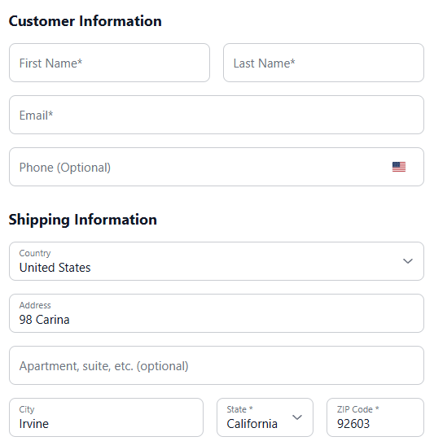

# Building a checkout page

A checkout page is one `<form>` that the SDK turns into a working checkout: package selection, customer fields, an order bump, hosted card fields, express payment buttons, and a live order summary. The SDK prices everything, validates the fields, creates the order, and sends the visitor to the next page. Every example below is condensed from `checkout.html` in the `apollo` starter template ([campaign-cart-starter-templates](https://github.com/NextCommerceCo/campaign-cart-starter-templates)), except the address block, which the template does not use.

The page declares itself in the head. See [Getting started](../start-here/getting-started.md) for the full boot setup:

```html
<meta name="next-page-type" content="checkout">
<meta name="next-success-url" content="/upsell-1/">
```

Everything else lives inside the form root:

```html
<form data-next-checkout="form" method="post"></form>
```

## Package selection

The bundle selector presents the offer tiers as clickable cards. Each card declares its cart contents as JSON; clicking a card swaps the whole cart to that tier.

```html
<div
  data-next-bundle-selector
  data-next-selector-id="drone-packages"
  data-next-selection-mode="swap"
  data-next-include-shipping="true"
  data-next-await=""
>
  <div
    data-next-bundle-card
    data-next-bundle-id="drone-qty-1"
    data-next-shipping-id="2"
    data-next-bundle-items='[{"packageId":1,"quantity":1}]'
    data-next-selected="true"
    role="button"
  >
    
    <div>1x <span data-next-display="package.name">Package Title</span></div>
    <div data-next-bundle-display="hasDiscount">
      SAVE <span data-next-bundle-display="discountPercentage">-</span>
    </div>
    <span data-next-bundle-display="originalUnitPrice">-</span>
    <span data-next-bundle-display="unitPrice">-</span>/ea
    <span data-next-bundle-display="originalPrice">-</span>
    <span data-next-bundle-display="price">-</span>
  </div>
  <div
    data-next-bundle-card
    data-next-bundle-id="drone-qty-2"
    data-next-shipping-id="2"
    data-next-bundle-items='[{"packageId":1,"quantity":2}]'
    role="button"
  >
    <div>2x <span data-next-display="package.name">Package Title</span></div>
    <span data-next-bundle-display="price">-</span>
  </div>
</div>
```

The pieces that matter:

- `data-next-bundle-items`: the tier's cart lines, as JSON.
- `data-next-selected="true"`: the pre-selected default tier.
- `data-next-selection-mode="swap"`: picking a tier replaces the previous one.
- `data-next-shipping-id`: a per-tier shipping method; with `data-next-include-shipping="true"` the card price includes it.
- `data-next-bundle-display`: that card's calculated prices.
- `data-next-await`: the template's loading gate. The SDK adds the `next-display-ready` class to `<html>` when its DOM scan finishes, and the template's `next-core.css` keeps anything under `data-next-await` invisible until then, so the visitor never sees `-` placeholders flash. The SDK only sets the class; without that stylesheet the attribute does nothing.

## Contact and address

The page writes the email field itself, and the SDK builds each address from the selected country's rules, the customer's name and phone included.

Below is an example of the email field, the shipping address, and a billing address that closes when the shopper ticks the box, with its labels and headings in the page's language.

```html
<h2 data-next-i18n="checkout.contact.title">Contact</h2>
<label for="email" data-next-i18n="fields.email.label">Email</label>
<input
  id="email"
  type="email"
  autocomplete="email"
  required
  placeholder="Email"
  data-next-checkout-field="email"
  data-next-i18n="[placeholder]fields.email.label"
>

<h2 data-next-i18n="checkout.shipping.title">Shipping address</h2>
<div data-next-address="shipping"></div>

<label>
  <input type="checkbox" name="use_shipping_address">
  <span data-next-i18n="checkout.billing.same_as_shipping">
    Use shipping address as billing address
  </span>
</label>
<div data-next-component="different-billing-address">
  <h2 data-next-i18n="checkout.billing.title">Billing address</h2>
  <div data-next-address="billing"></div>
</div>
```

The SDK ships these headings and the email's label in every language it supports; [Translated text](../reference/data-attributes.md#translated-text) lists the keys and covers the rest of the page's words.

### Contact information

The contact step is the email field, which the page writes. The name and phone are part of the shipping address, so the address block builds them. Its label and placeholder take the page's language from the `fields.email.label` key ([Translated text](../reference/data-attributes.md#translated-text)).

The SDK requires the first name, last name and email, and the phone is optional unless its input carries `required` or `data-next-required="true"`. No field accepts an emoji.

### Shipping address

The shipping step is an empty `<div data-next-address="shipping"></div>`, which the SDK turns into the fields the selected country collects, in the order that country writes them.

In a country with one city or postcode for every address, such as Vatican City, the block does not ask for it and the SDK sends it with the order. The checkout form still fills the country list with the countries the campaign ships to and the state list with the selected country's states, validates the fields, and keeps the city, state and postcode row hidden until the street address has a value.

[Address block](../reference/data-attributes.md#address-block) lists its attributes, and [Styling](#styling) below covers its markup.

Limits to plan for:

| Limit | Description |
|---|---|
| Loading | Fields arrive after a network request |
| Before the country is known | The block shows US fields |
| Third address line | Not collected; orders carry two |

If the fields cannot be loaded, the block shows a generic English address form instead, with state and postcode optional, so the shopper can still check out.

> **Watch out:** Writing the address inputs yourself is deprecated, for the billing address as well as the shipping one. The starter template still does both, so do not copy its address inputs or its `shipping-form`, `shipping-field-row` and `billing-form` containers. Use `data-next-address="shipping"` and `data-next-address="billing"` instead: static fields are the same in every country and miss every later fix to a country's address rules.

### Billing address

A separate billing address is a second address block, `data-next-address="billing"`, inside the `different-billing-address` section. It builds the same fields as the shipping block, named `billing-address1`, `billing-city` and so on. A checkbox named `use_shipping_address` opens and closes the section: checked means billing matches shipping, and the SDK collapses it.

### Validation messages

Validation messages are whole sentences in the form's language, `window.nextConfig.locale`, or English when it is unset: `Enter a ZIP Code` in the US, `กรุณากรอกรหัสไปรษณีย์` on a Thai page. Each field has its own. To change one, set it in `translations` for that language, keyed by the field and what is wrong with it. A key you leave out keeps the default.

Below is an example that rewords the message for an empty apartment line and for a postcode in the wrong format, on a Thai page.

```html
<script>
  window.nextConfig = {
    locale: "th-TH",
    translations: {
      th: {
        "fields.line2.errors.blank": "กรุณาระบุห้องหรืออาคาร",
        "fields.postcode.errors.invalid": "รหัสไปรษณีย์ไม่ถูกต้อง ลอง {{example}}",
      },
    },
  };
</script>
```

The key is `fields.<field>.errors.<error>`. One key covers the field in every country, whatever the country calls it, and `{{example}}` becomes the country's example.

| Error | Description |
|---|---|
| `blank` | A required field left empty |
| `not_selected` | Nothing chosen in a dropdown |
| `invalid` | Wrong format, or not in the list |
| `invalid_characters` | A name with digits or symbols |
| `contains_emoji` | A field holding an emoji |

The fields are named as the address service names them.

| Field | Description |
|---|---|
| `first_name`, `last_name` | The name fields |
| `email`, `phone_number` | The contact fields |
| `line1`, `line2` | The street lines |
| `city`, `state`, `postcode` | The locality fields |
| `country` | The country select |

In a language the address service does not have, a message you do not give is shown in English, as a whole sentence.

### Styling

The SDK ships no styling for the block, and rules written against your own input classes do not reach it: the fields it builds carry their own classes. Style them through the classes and attributes it sets.

Below is an example of the markup the block builds for a US address, cut down to the street and the city and ZIP row, with the attributes that do not matter for styling left out.

```html
<div data-next-address="shipping" data-next-address-state="ready">
  <div class="next-address-row" data-next-address-row="2">
    <div
      class="form-group next-address-field"
      data-next-address-field="address1"
    >
      <input
        class="next-address-control"
        data-next-checkout-field="address1"
        placeholder="Address"
      >
      <label class="next-address-label">Address</label>
    </div>
  </div>
  <div
    class="next-address-row"
    data-next-address-row="4"
    data-next-component="location"
  >
    <div
      class="form-group next-address-field"
      data-next-address-field="city"
      style="flex-grow: 2"
    >
      <input
        class="next-address-control"
        data-next-checkout-field="city"
        placeholder="City"
      >
      <label class="next-address-label">City</label>
    </div>
    <div class="form-group next-address-field" data-next-address-field="postal">
      <input
        class="next-address-control"
        data-next-checkout-field="postal"
        placeholder="ZIP Code"
      >
      <label class="next-address-label">ZIP Code</label>
    </div>
  </div>
</div>
```

| Selector | Description |
|---|---|
| `.next-address-row` | One row of fields |
| `.next-address-field` | The wrapper around one field |
| `[data-next-address-field="postal"]` | One field, by its checkout name |
| `.next-address-control` | The input or select |
| `.next-address-label` | The label, after its control |
| `[data-next-address-state]` | `loading`, then `ready` |
| `.has-error` | On a control that failed validation |
| `.next-error-label` | The error message under it |

The label comes after its control so a stylesheet can reach it from the control's state, and every input has a placeholder, so a floating label needs no script. The SDK sets an inline `display` on the city, state and postcode row when it shows it (`flex`), and an inline `flex-grow` on wider fields such as the city, so lay the rows out with flex, and never hide a row with an `!important` rule, or it stays hidden.

Below is a stylesheet that gives the block bordered fields with floating labels and a drop-down arrow on the selects, puts each row on one line, holds space while the fields load, and marks failed fields. It is the one the [playground example](https://developers.nextcommerce.com/playground) uses for its address fields.

```css
[data-next-address] .next-address-row {
  display: flex;
  gap: 16px;
  margin-bottom: 16px;
}
[data-next-address] .next-address-field {
  position: relative;
  flex: 1;
  min-width: 0;
}
[data-next-address-state='loading'] {
  min-height: 256px;
}
.next-address-control {
  box-sizing: border-box;
  width: 100%;
  height: 48px;
  padding: 18px 12px 4px;
  border: 1px solid #c9ccd1;
  border-radius: 8px;
  background: #fff;
  color: inherit;
  font: inherit;
  font-size: 15px;
}
select.next-address-control {
  appearance: none;
  padding-right: 36px;
  background: #fff url("data:image/svg+xml,%3Csvg xmlns='http://www.w3.org/2000/svg' viewBox='0 0 14 14' fill='none' stroke='%236b7280' stroke-width='1.5' stroke-linecap='round' stroke-linejoin='round'%3E%3Cpolyline points='2 4.75 7 9.25 12 4.75'/%3E%3C/svg%3E")
    no-repeat right 12px center / 14px;
}
.next-address-control:placeholder-shown {
  padding: 12px;
}
.next-address-control::placeholder {
  color: #6b7280;
}
.next-address-control:focus {
  border-color: #2563eb;
  outline: none;
}
.next-address-control.has-error {
  border-color: #dc2626;
}
.next-address-label {
  position: absolute;
  top: 6px;
  left: 13px;
  color: #6b7280;
  font-size: 11px;
  pointer-events: none;
}
.next-address-control:placeholder-shown + .next-address-label {
  display: none;
}
[data-next-address] .next-error-label {
  display: block;
  margin-top: 4px;
  color: #6b7280;
  font-size: 12px;
}
[data-next-address] .next-error-label {
  color: #dc2626;
}
```

Below is the playground example with this stylesheet, a US address filled in.



> **Watch out:** Style a field by its name, with `[data-next-address-field="postal"]`, never by its row number. Rows differ per country, so `data-next-address-row="4"` holds the city and postcode for one country and something else for the next.

## Order bump

An order bump is a checkbox card that adds a second package to the order when toggled. From `_includes/bump-check01.html`:

```html
<div data-next-package-toggle data-next-await="">
  <div
    data-next-toggle-card
    data-next-is-upsell="true"
    data-next-package-sync="1"
    data-next-package-id="7"
  >
    <div>Get Extended Warranty</div>
    <span data-next-toggle-display="originalUnitPrice">--</span>
    <span data-next-toggle-display="unitPrice">--</span>/ea
    
  </div>
</div>
```

`data-next-package-sync="1"` keeps the bump's quantity equal to the cart quantity of package 1. `data-next-toggle-display` accepts per-unit tokens (`unitPrice`, stable across tiers) or line totals (`price`, which scales with the synced quantity). Pick one pricing style per card.

## Payment

Payment methods are declared as radio sections. The card fields are the deliberate exception to "you write the inputs": `cc-number` and `cvv` are empty `<div>`s, and the SDK mounts hosted payment fields into them, so no card number ever passes through your page. From `_includes/payment-methods.html`:

```html
<div data-next-payment-method="credit">
  <input type="radio" name="payment_method" value="credit" checked>
  <div data-next-payment-form="credit">
    <div data-next-component="credit-error">
      <div data-next-component="credit-error-text">Error message</div>
    </div>
    <div data-next-checkout-field="cc-number"></div>
    <select data-next-checkout-field="exp-month">
      <option value="">Exp. Month</option>
    </select>
    <select data-next-checkout-field="exp-year">
      <option value="">Exp. Year</option>
    </select>
    <div data-next-checkout-field="cvv"></div>
  </div>
</div>
```

The starter templates ship the same pair for `paypal`, `klarna`, `apple-pay`, and `google-pay`: each `data-next-payment-method` section with a matching `data-next-payment-form` and its own `*-error` / `*-error-text` slots.

The card is the only method that collects anything on your page. Every other method the SDK accepts, including iDEAL, Bancontact, SEPA Direct Debit, TWINT, Swish, Affirm and Link, is approved on the provider's own page: add the radio with the method's name and leave its `data-next-payment-form` empty. Submitting validates the form and captures the shopper's details as usual, creates the order, then sends the shopper to the address the orders API returns. [Payment methods](../reference/data-attributes.md#payment-methods) lists every value.

Express checkout is two containers; the SDK injects the wallet buttons into the second, in the order configured by `paymentConfig.expressCheckout` in your `config.js`:

```html
<div data-next-express-checkout="container">
  <div data-next-component="express-error">
    <div data-next-component="express-error-text">Error message</div>
  </div>
  <div data-next-express-checkout="buttons"></div>
</div>
```

## Order preview

The live summary renders the cart from a `<template>` using `{item.*}` tokens, with per-discount rows below it. Condensed from `_includes/cart-summary01.html`:

```html
<div data-next-cart-summary>
  <template>
    <div data-summary-lines>
      <template>
        <div data-package-id="{item.packageId}">
          {item.quantity}x {item.name}
          <span class="{item.hasDiscount}">{item.originalPrice}</span>
          <span>{item.price}</span>
        </div>
      </template>
    </div>
    <div>Subtotal {subtotal}</div>
    <ul data-next-discounts="voucher">
      <template>
        <li>{discount.name} −{discount.amount}</li>
      </template>
    </ul>
    <div>Shipping {shipping}</div>
    <div>Grand Total: {currency}{total}</div>
  </template>
</div>
```

## Create order

The submit button is a plain `type="submit"` button inside the form. No `data-next-*` attribute is needed. On submit the SDK validates, tokenizes payment, creates the order once, then sends the visitor to `next-success-url` with `?ref_id=` appended so the next page can load the order (`checkout-form.enhancer.ts › CheckoutFormEnhancer`). The button is the only way to submit: Enter in a field moves to the next field, and the keyboard labels its Enter key to match (`checkout-form/enter-key-navigation.ts › setupEnterKeyNavigation`).

## Debugging

Open the page with `?debugger=true`. The Checkout panel lists every field the SDK matched, its validation state, and the raw data it will send, so a field that never reaches the order shows up before you submit. The Cart and Campaign panels confirm prices loaded. See [Debugger](../reference/debugger.md).

Opening the debugger also puts the page in test mode, so pay with a test card while it is on.

## Cautions

- **The card field `<div>`s must stay empty.** The SDK mounts hosted fields into them; putting an `<input>` there means two competing fields and a checkout that cannot tokenize. Leave them as empty elements with the `data-next-checkout-field` name.
- **An unrecognised field name is silently not part of the order.** The names are fixed (`fname`, not `firstName`; `postal`, not `zip`). If a value the visitor typed never reaches the order, check the spelling against the field names in this guide's examples.
- **Wrap price-bearing sections in `data-next-await`.** Without it the visitor sees placeholder dashes until campaign prices load. The hiding is done by the template's `next-core.css`, keyed on the `next-display-ready` class the SDK adds to `<html>`. Keep that stylesheet on the page or the attribute does nothing.
