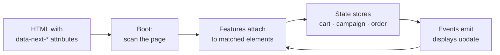

# How the SDK works

The markup is the configuration. You never instantiate anything: you put `data-next-*` attributes on the elements you already have, and when the page loads the SDK finds them, attaches the matching feature to each one, and keeps them live from then on.



What each piece is:

- **Attributes** are the public contract. `data-next-bundle-selector` turns a `<div>` into a package picker; `data-next-checkout="form"` turns a `<form>` into a checkout. The [Building Pages guides](../pages/checkout-page.md) show the ones real funnels use.
- **Features** are the code behind the attributes, one per capability. The [Data Attributes reference](../reference/data-attributes.md) lists every attribute that turns one on.
- **State** is a handful of stores: the cart, the loaded campaign, the checkout form, the completed order. Features read and write them; your own code can too, through `window.next` ([JavaScript API](../reference/javascript-api.md)) and the exported store hooks.
- **Events** tie it together. Every change emits a typed event (see {@link EventMap} for all of them) and displays re-render when the state they bind to changes.

Boot happens once per page load, in 14 ordered steps: configuration, campaign fetch, cart restore, then the DOM scan, then `next:initialized`. Elements added to the page *after* boot are enhanced too: a DOM observer watches for new `data-next-*` matches.

## The three kinds of markup

Real funnel pages mix three kinds of markup, and confusing them is the most common authoring mistake:

**Activation attributes** turn an element into a feature and configure it in place:

```html
<div
  data-next-bundle-selector
  data-next-selector-id="main"
  data-next-selection-mode="swap"
>
  <div
    data-next-bundle-card
    data-next-bundle-id="qty-1"
    data-next-bundle-items='[{"packageId":1,"quantity":1}]'
    role="button"
  ></div>
</div>
```

**Display bindings** put one live value into one element. The value is named by a dotted path whose first segment is the namespace: `cart.*`, `order.*`, `package.*`, `bundle.<selectorId>.*`, `shipping.*`, or `param.*`:

```html
<span data-next-display="cart.total">$0.00</span>
<span data-next-display="package.name">Package Title</span>
<div data-next-show="cart.hasItems">You have items in your cart</div>
```

**Template tokens** render repeating lines. A list container (`data-summary-lines` in the cart summary, the discount lists, the receipt's order items) owns a `<template>` and stamps it once per line, replacing single-brace tokens. In the cart summary that list container sits inside the summary's own `<template>`:

```html
<div data-next-cart-summary>
  <template>
    <div data-summary-lines>
      <template>
        <div>{item.quantity}x {item.name} {item.price}</div>
      </template>
    </div>
    <div>Total {total}</div>
  </template>
</div>
```

Tokens only mean something inside a `<template>` owned by a list feature. A `{item.name}` outside one is plain text and stays on screen verbatim.

## Cautions

- **Nothing works before `next:initialized`.** Before boot finishes, the cart looks empty and `window.next` is undefined. The symptom is code that works in the console but not on load. Queue it on `window.nextReady` instead; see [Getting started](./getting-started.md).
- **A display path is not a template token.** `data-next-display="cart.total"` binds an element; `{total}` only works inside a list feature's `<template>`. Mixing them up leaves either a literal `{total}` on screen or a binding that never fills. Check which kind of markup the feature's guide uses.
