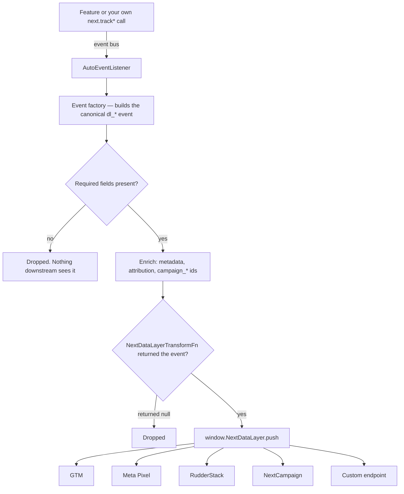

# Analytics

> Category: `core`
> Last reviewed: 2026-07-31
> Owner: Campaign Cart SDK

Analytics turns what the shopper does on a campaign page — viewing a product, adding
it to the cart, starting checkout, buying — into named ecommerce events, and hands
those events to whichever destinations the page configured: Google Tag Manager, the
Meta Pixel, RudderStack, 29Next's own campaign platform, or an endpoint of your own.
The page does not write tracking code for any of it; the features already emit what
happened, and this subsystem is what listens, shapes it, and forwards it. It is the
largest part of the engine (27 files) and the only part that talks to third parties.

## Concept

Think of it as **a one-way pipe with two halves**, and keep the halves separate when
something goes wrong.

The first half **produces** events. A feature does something, announces it on the
[event bus](./event-bus.md), and `AutoEventListener` translates that into a canonical
`dl_*` event — one vocabulary, the same names on every page, regardless of who ends up
receiving them. Three other producers feed the same pipe: the page-view and list
trackers that watch the page itself, the `<meta name="next-analytics-*">` controls, and
your own `next.track*` calls. Whatever the source, the event is validated, stamped with
session, attribution and campaign identifiers, and appended to `window.NextDataLayer`.
That array is the SDK's own record of what happened, and it exists whether or not a
single provider is configured.

The second half **forwards**. Each configured provider is an adapter sitting on top of
that array; when an event lands, every adapter is offered it and decides what its own
destination gets — the name unchanged, renamed through a table, or nothing at all.
Adapters never feed each other and never block each other.

**Which half you are in decides how you debug.** Open the console and read
`window.NextDataLayer`:

- **The event is not in the array.** It was never produced, or it was dropped before
  the push. Nothing at any destination will ever have it, and no provider is at fault.
  Causes, in the order to check them: analytics was never switched on; the visit is
  being ignored (`?ignore=true` earlier in the session); a required field was missing;
  a transform function returned `null`; the event was deliberately held for the next
  page after a redirect.
- **The event is in the array but missing at a destination.** That is a provider
  question, and every provider records what it did with every event — `sent`,
  `blocked`, `skipped`, `failed`, or still `pending` — with the payload it was handed,
  the payload it dispatched, the error, and how long it took. Recording is on in
  **every** build, not only debug ones. Read it in the debug overlay's **Analytics &
  Events** panel: the strip at the top lists the registered providers, each event row
  carries one chip per provider, and the row's **Flow** tab shows the per-provider
  payloads. Turn the overlay on with `?debugger=true` **before** reproducing the
  problem — the buffer holds the last 250 deliveries, and there is no console API for
  it.

The row-by-row version of that walk, with a source line and a fix for each stop, is
[Analytics providers › When nothing arrives](../reference/analytics-providers.md#when-nothing-arrives).
None of those stops throws, which is why reading the recorded outcome beats inferring
from an absence.

## Business logic

- **Nothing is sent until the page switches it on, and no meta tag switches it on.**
  The config store has no `analytics` block by default, so `config.analytics?.enabled`
  is `undefined` and the analytics boot returns at its first check
  (`core/analytics/index.ts › NextAnalytics.initialize`). Only `window.nextConfig.analytics.enabled = true`,
  set before the SDK loads, starts it. A page with a GTM container on it and no
  `analytics` block sends zero events, and the only trace is one info log,
  `Analytics disabled in configuration`.
- **Providers are optional; the data layer is not.** With `enabled: true` and *no*
  provider configured, every event is still built, validated, enriched and pushed to
  `window.NextDataLayer`. Providers are forwarders on top of that array, so your own
  script can read the array and be the only consumer.
- **One visit can be excluded for the whole session.** `?ignore=true` writes
  `analytics_ignore` into sessionStorage and outlives the parameter, so every later
  page in that session is silent too. Clear it with `window.NextAnalyticsClearIgnore()`
  or a fresh session.
- **`mode: 'auto'` is what makes events fire from page activity.** In `'manual'` mode
  the vocabulary is identical, but the only sources are the meta-tag controls and your
  own `next.track*` calls.
- **The event vocabulary is closed.** `DL_EVENTS` in `analytics/schemas/events.ts` is
  the single source of truth for all 35 names, and
  `src/tests/utils/analyticsVocabulary.test.ts` scans the analytics source in both
  directions and fails CI on drift — a name emitted but not declared, or declared but
  emitted nowhere. An event name invented at an emit site fails the build rather than
  reaching a provider.
- **Two different validators, and only one of them can drop an event.** The
  required-field rules in `analytics/config.ts` run on every push and **drop** the
  event before it reaches the array (`data-layer-manager.ts › DataLayerManager.push`) — for example
  `dl_add_to_cart` without `ecommerce.currency`. The richer field-schema validator runs
  **only in debug mode** and only reports; it never blocks. So a payload problem you
  can see logged in debug may have been shipped in production.
- **Every event carries the campaign's identity and the visit's attribution**, stamped
  centrally rather than by each factory, so events that bypass the factories (page
  views, upsells, route changes) carry them too. Without an API key the campaign never
  loads and events go out without those identifiers, after one warning at init.
- **Revenue follows the GA4 rule**: `value` is the sum of `price × quantity` over the
  items, with tax and shipping in their own fields. Mismatches are diagnosed by the
  validator, not corrected.
- **Analytics starts after campaign data is loaded and before the DOM is scanned**
  (boot step 6, see [boot sequence](../reference/boot-sequence.md)), so product events
  have prices to report. Its failure is non-critical: boot logs a warning and
  continues, leaving a page that works and reports nothing.
- **An event fired immediately before a redirect is held, not lost.** It is queued and
  replayed roughly 200 ms into the next page, which is how an accepted upsell avoids
  being counted on both pages.

## Decisions

- **We chose an explicit `enabled` flag over analytics-on-by-default** because these
  pages carry real traffic into a client's reporting: a page that silently sends is a
  mess to unpick, while a page that silently does not send costs one config line to
  fix. The cost of that choice is the confusion this page opens with, which is why the
  default is stated first in every analytics doc.
- **We chose one canonical `dl_*` vocabulary with per-provider rename tables over
  sending vendor-native names through the pipe** because a single event has five
  possible destinations. One name means `blockedEvents`, the debug overlay, and
  `window.NextDataLayer` all agree, and each adapter owns its own translation.
- **We chose a closed vocabulary enforced by a test over free-form event names**
  because `blockedEvents` matches verbatim: a typo used to produce a silent no-op
  (`blockedEvents: ['purchase']` against a real `dl_purchase`) that looked like
  working configuration.
- **We chose to record delivery outcomes in every build rather than in debug builds
  only** because the failures here are silent by construction — a swallowed throw, an
  unmapped name, a pixel that never loaded. Recording is a capped ring buffer, so it
  costs little and is there when the problem is already reproduced.
- **We chose to swallow provider failures over letting them propagate** so one broken
  destination cannot stop the other four, or the page. The trade is that a failure is
  invisible in the console unless you read the recorded outcome, which is the trade the
  debug tracker exists to pay for.

## Limitations

- **It does not load your vendor scripts.** GTM, the Meta Pixel and RudderStack must
  already be on the page; the adapters wait 5 seconds for `fbq` / `rudderanalytics` to
  appear and then record every event as `failed`. NextCampaign is the one exception —
  it loads its own script using the campaign API key.
- **There is no GA4 provider.** Sending to GA4 means letting GTM do it; the SDK
  forwards `dl_*` events into `window.dataLayer` unchanged and your container maps
  them.
- **`window.NextDataLayer` is a plain array, not an intercepted queue.** Pushing into
  it from your own code appends a value and notifies nobody — no enrichment, no
  provider forwarding. To send an event, call the SDK.
- **`blockedEvents` reaches all five providers.** Every adapter is constructed with its
  provider config, so a blocked name is suppressed everywhere. Before 2026-07-31 only GTM
  and Meta received the list and the other three ignored it silently, so a destination-side
  filter added as a workaround is now redundant.
- **The `next-analytics-disable` and `next-analytics-enable-only` meta tags do
  nothing.** They are parsed, and the method that would apply them has no caller — a
  page carrying them sends its full event set. See
  [meta tags](../reference/meta-tags.md).
- **`window.nextConfig.enableAnalytics` and `window.nextConfig.tracking` are dead
  fields.** They read like the switch and are never consulted; the `analytics` block is
  the only one that counts.
- **Delivery records are not reachable from a console.** `AnalyticsDebugTracker` is not
  exposed on `window`, so a page that cannot open the debug overlay cannot read what it
  faithfully recorded.
- **An event dropped before the push leaves no delivery record at all**, because no
  provider was ever asked. Absence from the overlay is a data-layer answer, not a
  provider one.
- **No consent management and no server-side dispatch.** Every event leaves from the
  browser, and nothing here asks whether the visitor agreed to it.
- **No hashing or redaction of customer identity.** Fields such as `customer_email` go
  to a provider as the event factory built them; if a destination needs them hashed,
  hash them in `window.NextDataLayerTransformFn` or at that destination.

## See also

- [Analytics events](../reference/analytics-events.md) — every `dl_*` event, its
  payload field by field, and which destination sees it under which name.
- [Analytics providers](../reference/analytics-providers.md) — the per-provider matrix,
  the `dl_` prefix rules, and the full ladder for an event that never arrives.
- [`useConfigStore`](../../../state/config/guide/reference/state-reference.md) — the
  `analytics` block that decides whether any of this runs.
- [Event bus](./event-bus.md) — the channel features announce on, which is what
  analytics listens to.
- [Logging and the debug overlay](./logging-and-debug.md) — what reaches the console,
  and how to open the panel that shows deliveries.
- [The SDK engine](../overview.md) — how this subsystem sits with the rest.
