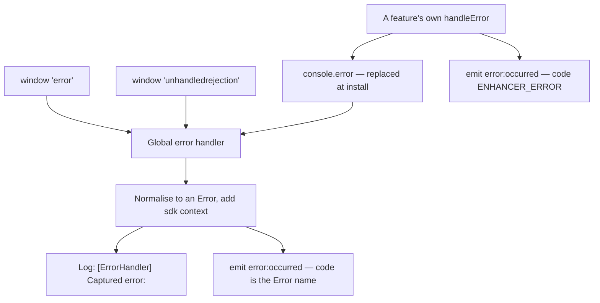

# Error capture

> Category: `core`
> Last reviewed: 2026-07-31
> Owner: Campaign Cart SDK

Error capture is what keeps one failing feature from taking a campaign page down with
it, and what lets you find out that it failed. Every runtime error the SDK meets — an
uncaught throw, a rejected promise, a feature that could not render — is normalised,
given the context needed to reproduce it (SDK version, URL, user agent, the failing
feature), written to the console, and announced on the [event bus](./event-bus.md) as
`error:occurred`. It sends nothing anywhere. If you want errors in a monitoring service,
subscribe to that event and forward them yourself.

## Concept

**It observes; it does not intervene.** The isolation that keeps the page alive comes
from the features themselves — each one wraps its own work and reports through the same
path — and this subsystem is the single place those reports converge so that one
subscriber can watch the whole SDK.

There are two independent producers of `error:occurred`, and telling them apart is what
makes a subscriber useful:



The third intake is the one to understand before you write a handler: **the SDK replaces
`console.error`**. The original is called first, so the browser console keeps everything
it would have shown; then, if the first argument is an `Error` — or a string whose text
contains "error" — it is captured and re-announced. That is deliberate (it catches
failures no one thought to report explicitly) and it has a cost:

- Anything **your** page logs through `console.error` arrives as `error:occurred`. A
  handler that treats every one as an SDK fault over-reports. Filter on
  `details.source === 'console.error'` if you need to exclude that path, or on
  `code === 'ENHANCER_ERROR'` to keep only feature failures.
- A feature failure normally produces **two** events: the feature's own
  (`code: 'ENHANCER_ERROR'`, with the enhancer name, the context, and the element) and a
  second one from the console interception of the log line it wrote. De-duplicate on
  `details.enhancer` or count only `ENHANCER_ERROR` if the volume matters.
- A `console.error` whose first argument is neither an `Error` nor a string containing
  "error" is not captured at all. `console.warn` is never captured.

The payload is small on purpose: `message`, `code`, and `details`.

```js
next.on('error:occurred', ({ message, code, details }) => {
  // details.sdk = { version, timestamp, url, userAgent }
  // details.enhancer / details.context are present for feature failures
  if (code === 'ENHANCER_ERROR') {
    myMonitor.captureMessage(message, { feature: details.enhancer });
  }
});
```

## Business logic

- **The handler installs at boot step 9, in the background.** It is loaded through a
  dynamic import that boot does not wait for, so treat it as available shortly after
  boot rather than exactly at boot. Errors thrown **earlier** — reading configuration,
  detecting the country, loading the campaign, starting analytics — are never captured
  and never produce `error:occurred`. A failed boot is diagnosed from the console and
  from [boot sequence › When a step fails](../reference/boot-sequence.md#when-a-step-fails),
  not from this event.
- **What triggers a capture:** an uncaught `error` event on `window`, an
  `unhandledrejection`, a `console.error` whose first argument is an `Error` or a string
  containing "error" (case-insensitive), or a feature calling its own `handleError`.
- **Every capture is enriched, never replaced.** The original context is kept and an
  `sdk` block is added — version, an ISO timestamp, `window.location.href`, and the user
  agent — so a subscriber has enough to reproduce without the page adding anything.
- **`code` tells you the producer.** Features send `ENHANCER_ERROR`; the global handler
  sends the `Error`'s own `name`, so `Error`, `TypeError`, `DispatchError`, and so on.
- **Re-entrant captures are dropped.** A flag is held while an error is being handled,
  so an error raised *by* a subscriber, or by the logging of an error, cannot loop. The
  same flag means a genuine second error thrown during the handling of the first is
  lost rather than queued.
- **Nothing is ever reported off the page.** `captureMessage` and `addBreadcrumb` exist
  on the handler and do nothing — remote error tracking was removed on purpose, and the
  `error:occurred` event is the seam it left behind.
- **A `null` or `undefined` error is ignored**, and a non-`Error` value is wrapped with
  `String(value)` as its message, so a `throw 'oops'` still arrives as an event.
- **Console output is a separate question from the event.** Whether a given log level
  reaches the console depends on the logger's level rules and on which bundle the page
  loaded — see [logging and the debug overlay](./logging-and-debug.md). The event is
  emitted regardless of what the console shows, for every error that reaches the
  handler.

## Decisions

- **We chose to observe `console.error` rather than require every call site to report
  explicitly** because the SDK already funnels its failures through its logger, and a
  single interception picks up code paths nobody remembered to instrument. The cost is
  the false-positive class named above, which is why the `code` and
  `details.source` fields exist.
- **We chose to announce on the event bus rather than ship to a monitoring service**
  because the page's owner picks their own vendor. Bundling one would embed a third
  party — and a consent question — into every campaign page that loads the SDK.
- **We chose a re-entrancy flag over an emit queue** because the failure being guarded
  against is a subscriber that logs the error it was handed. A flag makes that inert; a
  queue would keep the loop alive with extra bookkeeping.
- **We chose to enrich the captured context instead of replacing it** so the fields the
  throw site supplied — filename, line, the enhancer, the promise — survive alongside
  the SDK context, and one subscriber can read both.
- **We chose to install the handler in the background rather than block boot on it**
  to keep it off the critical path to a working page. The documented cost is that
  pre-step-9 failures escape capture, which is why the boot reference carries its own
  failure section.

## Limitations

- **No stack trace in the payload.** `message`, `code`, and `details` are what a
  subscriber gets; the `Error` object itself is not passed, so the stack is available in
  the console and not in your handler.
- **No capture before boot step 9**, including the first failure of a failing boot.
- **No de-duplication and no rate limit.** A loop that throws once per frame emits one
  event per throw, straight into whatever your handler does with it.
- **It does not catch errors raised while another error is being handled**, by design.
- **It does not catch `console.warn`**, nor a `console.error` whose first argument is a
  plain string with no form of the word "error" in it.
- **It prevents nothing.** Capturing an error does not retry the operation, restore the
  element, or hide a broken component; a feature that failed stays failed.
- **`captureMessage` and `addBreadcrumb` are no-ops.** Calling them looks like
  instrumentation and records nothing.

## See also

- [Errors](../reference/errors.md) — every error the engine throws, whether it is
  recoverable or fatal, what catches it, and the fix.
- [Logs](../reference/logs.md) — every console message by prefix and level, including
  the `[ErrorHandler]` lines.
- [Event bus](./event-bus.md) — how to subscribe, and why a throwing handler of yours
  can produce an error of its own.
- [Boot sequence](../reference/boot-sequence.md) — where step 9 sits, and what a failed
  boot looks like without this handler.
- [The SDK engine](../overview.md) — how this subsystem sits with the rest.
