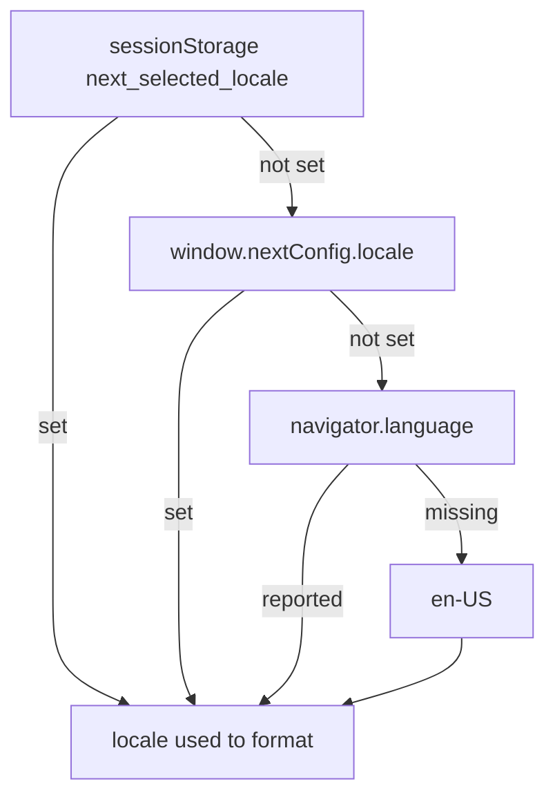

# How prices are written

Every amount a shopper sees — a package price, a cart total, a shipping line, a
discount — is turned into text by one module, `core/currency-formatter.ts`. This
page is about the *writing*, not the arithmetic: whether the total reads `€69.99`
or `69,99 €`, and how you decide which.

Those two strings are the same amount in the same currency. What separates them is
the **locale**.

## Concept

The currency code says *which money*. The locale says *how to write it*. They are
separate inputs to the same call, and only one of them controls the format:

```ts
new Intl.NumberFormat('en-US', { style: 'currency', currency: 'EUR' }).format(69.99);
// → "€69.99"   symbol first, dot decimal

new Intl.NumberFormat('de-DE', { style: 'currency', currency: 'EUR' }).format(69.99);
// → "69,99 €"  symbol last, comma decimal
```

This is the single most common surprise here: a campaign is switched to `EUR`,
the prices stay `€69.99`, and the currency looks broken. It is not — the locale is
still `en-US`.

Where that locale comes from is a four-tier lookup, most specific first
(`core/currency-formatter.ts › CurrencyFormatter.getUserLocale`):



1. **The debug overlay's locale picker**, kept in `sessionStorage`. Highest on
   purpose, so a store that pins its format can still be previewed in another one.
2. **`window.nextConfig.locale`** — the campaign's own choice.
3. **The visitor's browser**, which is the right answer most of the time: a German
   shopper's browser already asks for `69,99 €`.
4. **`en-US`**, for a browser that reports nothing.

The default is deliberately the visitor's, not the campaign's. Pin a locale only
when the store must read identically for everyone.

## Business logic

- **Formatters are cached per locale.** Both the currency and the plain-number
  formatter key their cache on the locale, so the two never disagree about the
  decimal separator on one page. `CurrencyFormatter.clearCache()` empties both;
  the debug picker calls it, then announces `next:currency-changed` so every
  renderer repaints without a reload.
- **An unusable locale is rejected at the door.** `new Intl.NumberFormat('de_DE')`
  — an underscore instead of a hyphen — throws. The config store canonicalises the
  tag when it loads it and drops it with a warning if it cannot, so a typo costs
  the pinned format, never the prices.
- **The currency itself comes from the campaign**, falling back to the config
  store's selected currency. Which currency a visitor is priced in is
  [Country, state, and currency](./geo.md); this page only decides how that
  currency is written.
- **Percentages are locale-independent** — `formatPercentage` builds `10%` by hand
  rather than through `Intl`, so a discount badge reads the same everywhere.
- **Analytics is never formatted.** Providers receive `69.99` from `toFixed(2)`,
  not `69,99`. A locale-aware number in an analytics payload is a broken payload,
  which is why that path deliberately does not use this module.

## Decisions

- **We chose an explicit `locale` option over deriving one from the detected
  country**, because geo detection has a three-second budget and falls back to
  US/USD. A derived locale would turn that timeout into `en-US` formatting forced
  onto a German visitor whose browser had already asked for German — worse than
  the behaviour it was meant to fix.
- **We chose the browser as the default over a campaign-wide default**, because it
  is correct for the ordinary case without anyone configuring anything, and the
  configuration exists for the case it is not.
- **We chose to let the debug picker outrank the campaign's pin**, because a
  preview tool that a pinned store can switch off is not a preview tool.
- **We chose not to map country → locale**, because one country is not one locale
  (Switzerland, Belgium and Canada each have several) and a wrong-language price
  reads worse than a foreign-format one.

## Limitations

- **Does not translate anything.** Only numbers and currency symbols follow the
  locale. Product names, labels and error messages stay as the campaign and the
  page author wrote them.
- **Does not format dates.** Date output is still hard-coded to `en-US` in
  `core/base/base-display-enhancer.ts` and `core/rendering/template-renderer.ts`,
  so a German shopper reads `August 4, 2026`. Pinning `locale` does not change it.
- **Does not reach the checkout review step.** That step formats with its own
  hard-coded `en-US`/`USD`, so it can disagree with the rest of the page.
- **Does not re-price.** Changing the locale changes how an amount is written, not
  what it is. To change the amount, change the currency — see
  [Country, state, and currency](./geo.md).
- **Symbol extraction assumes Latin digits.** `getCurrencySymbol()` strips digits
  and separators from a formatted zero, which breaks for locales with non-Latin
  digits (`ar-SA`) or apostrophe grouping (`de-CH`). Eurozone locales are
  unaffected.

## Reference

- [Storage keys](../reference/storage-keys.md) — `next_selected_locale`, what it
  holds and what clearing it costs.
- The `locale` field, with its validation and precedence notes, in the
  [config store reference](../../../state/config/guide/reference/state-reference.md).
- [Logging and the debug overlay](./logging-and-debug.md) — the locale picker.
