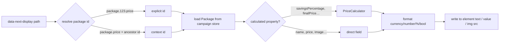

# Product Display

> Category: `display`
> Last reviewed: 2026-07-23
> Owner: frontend

`ProductDisplayEnhancer` binds a DOM element to a piece of **package or campaign data** and keeps it rendered and current. You put `data-next-display="package.price"` (or `package.name`, `package.savingsPercentage`, `campaign.name`, …) on an element, and the enhancer fills it in — formatted — and re-renders whenever the underlying data changes. It is the read-only counterpart to the cart/action enhancers: it never writes state, it only shows it.

## Concept

Think of it as a **one-way data binding** from campaign data to the DOM. Each element declares a *display path*; the enhancer resolves that path to a value, formats it, and writes it into the element — then repeats on every relevant change.

Three things make the mechanism work:

- **Path + context.** A path can carry its package id (`package.123.price`) or omit it (`package.price`) and let the enhancer resolve the id from an ancestor element's `data-next-package-id` (or a selector card). The same markup then works for any package by changing the ancestor id.
- **Direct vs calculated properties.** Plain fields (`name`, `price`, `image`) are read straight off the `Package`. Derived metrics (`savingsAmount`, `savingsPercentage`, `unitPrice`, `finalPriceTotal`, `hasSavings`, …) are computed on the fly by `PriceCalculator`.
- **Reactivity.** It subscribes to the campaign store (package data) and the cart store (discounts may change what's shown), and reacts to a `next:currency-changed` DOM event by reloading and re-rendering.

## Business logic

- **Trigger:** initialization (first render), then any campaign-store or cart-store change, a `next:currency-changed` event, or — when `data-next-multiply-quantity` is set — an `upsell:quantity-changed` event that matches this element's selector or package.
- **Formatting:** the value is formatted by type — `currency`, `number`, `percentage`, `boolean`, `date`, or `auto` (inferred) — overridable with `data-next-format`. Percentage paths auto-format as a percentage.
- **Element-aware output:** writes to `.value` on inputs/textareas, `.src` (+ alt) on images, and `.textContent` otherwise.
- **Conditional hiding:** `data-hide-if-zero` / `data-hide-if-false` hide the element (and a `data-container="true"` ancestor) when the value is zero/falsy.
- **Quantity multiplication:** with `data-next-multiply-quantity`, price properties are multiplied by the live quantity (used on upsell pages with a quantity control).
- **Assumption:** the campaign is loaded into `useCampaignStore` (data on `.data`); a path with no id must have an ancestor that provides one, or the element renders nothing and logs a warning.

## Decisions

- We compute savings/discount metrics client-side via `PriceCalculator` so a card can show "save 40%" without a server round-trip per element.
- We resolve the package id from context (ancestor `data-next-package-id`) so one product-card template is reusable across packages instead of hard-coding ids in every path.
- We subscribe to the cart store as well as the campaign store because applied discounts can change displayed prices — a display must not go stale after a coupon is applied.
- We keep this enhancer strictly read-only; all mutation goes through cart/action enhancers, so a display can never accidentally change state.
- We format by inferred type by default (`auto`) to keep the common case attribute-free, with `data-next-format` as the escape hatch.

## Limitations

- **Per-package discount breakdown is not available client-side**, so `discountAmount` / `hasDiscount` currently resolve to `0` / `false`; discount totals live on the cart (`voucherDiscounts` / `offerDiscounts`). Use retail-based `savings*` for per-package savings.
- Does not write or mutate any state — it is display only.
- Requires a resolvable package id; without an explicit id or an ancestor context it renders nothing.
- Reflects the campaign data as loaded; it does not itself fetch packages.
- The full path list lives in [reference/display-paths.md](./reference/display-paths.md), generated from the SDK's own routing table; this guide covers the mechanism, not every path.
