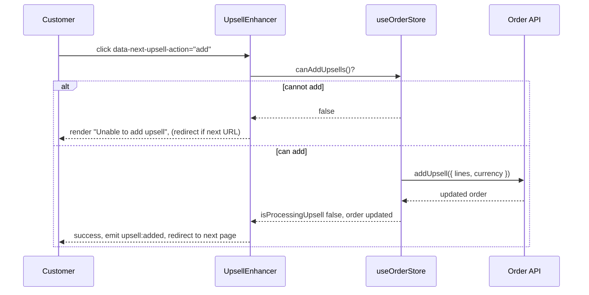

# Upsell

> Category: `order`
> Last reviewed: 2026-07-23
> Owner: frontend

`UpsellEnhancer` powers **post-purchase upsell** offers: after a customer has completed an order, it lets them add another package to that same order in one click — no re-entering card details, no second checkout. It binds to an element carrying `data-next-upsell` (a single offer) or `data-next-upsell-selector` (a choice of options) on an upsell page in the funnel.

## Concept

The enhancer is **reactive to the order store**. On an upsell page the SDK has already loaded the completed order into `useOrderStore`; the enhancer reads it, decides whether an upsell can still be added, and drives the offer's UI from that state.

An upsell can be added only when `useOrderStore.getState().canAddUpsells()` is true — that is, an order exists, the order's `supports_post_purchase_upsells` flag is set, and no upsell is currently being processed. When it is false the offer is hidden; when true the offer is shown.

It runs in one of two **modes**, chosen automatically at init:

- **Direct** — the element has `data-next-package-id`. One fixed package with an add (and optional skip) button.
- **Selector** — the element (or a child) declares a selector: `data-next-selector-id` with `data-next-upsell-option` cards or a `data-next-upsell-select` dropdown, or a linked `data-next-package-selector`/`data-next-bundle-selector`. The customer picks an option, then adds it.

## Business logic

- **Trigger:** a click on a `data-next-upsell-action` button. `add`/`accept` adds to the order; `skip`/`decline` skips the offer.
- **Gate:** adds are blocked unless `canAddUpsells()` is true. If the processing flag is stuck while the order still supports upsells, it is reset once and retried.
- **Duplicate guard:** if the chosen package was already accepted on this order (tracked in `completedUpsells` / `upsellJourney`), a confirmation dialog asks the customer whether to add it again.
- **Selection required:** in selector mode, an add with no option chosen (and no bundle items) renders "Please select an option first" and does nothing.
- **Quantity:** clamped to 1–10. Tracked per selector id when a selector is present, otherwise on the single offer.
- **Redirect:** after a successful add (or a skip), the customer is sent to the next page — resolved from `data-next-url` on the button, then `data-next-next-url` / `data-os-next-url`, then the `next-upsell-accept-url` / `next-upsell-decline-url` meta tags. The order's `ref_id` is appended to the URL and existing query params are preserved.
- **Resilience:** if the add API call fails but a next URL exists, the customer is still forwarded after a short delay so the funnel does not dead-end.
- **View tracking:** page views are recorded only when `<meta name="next-page-type" content="upsell">` is present, deduplicated to one per path per page load.
- **Assumption:** the order was loaded into `useOrderStore` by the SDK before this enhancer initializes, and that store expires 15 minutes after the order completes.

## Decisions

- We drive visibility from `canAddUpsells()` rather than a manual flag, so an offer that can no longer be added (unsupported order, or expired session) hides itself without page-specific code.
- We forward to the next page even when the add API call fails, because stranding a customer on a broken upsell page loses the sale that already completed — the funnel must keep moving.
- We resolve the linked package/bundle selection at click time (not init), so the offer always reflects the customer's current choice rather than a stale one.
- We support meta-tag fallback URLs (`next-upsell-accept-url` / `next-upsell-decline-url`) so a shared next-page target can be set once per page instead of on every button.
- We clamp quantity to 1–10 to keep a post-purchase add-on within a sane range without needing per-campaign configuration.

## Limitations

- Does not create or modify the payment — it only appends lines to an order the store already marks as supporting post-purchase upsells.
- Does not work once the order store has expired (15 minutes after completion); the offer will hide because no order is present.
- Does not manage the checkout or the initial order — see the checkout feature for that; this is strictly post-purchase.
- Does not choose which packages to offer; the package IDs come from the campaign and are placed in the markup by the page author.
- The `data-next-upsell` attribute's value is not interpreted (e.g. `data-next-upsell="offer"`); only its presence activates the enhancer.
